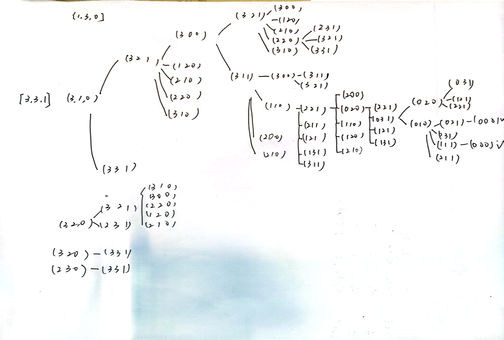

### 3.7
a
初始状态：地图没有染色
目标测试：所有地区都被染色且相邻地区颜色不同|
后继函数：在一个未染色的地区中选择一种与周围邻居颜色不同的颜色
耗散函数：已染色地区数量与总地区数量的比值，值越接近1表示越接近目标状态
b
初始状态：猴子在屋子的底部，香蕉悬挂在8英尺高的房顶上
目标测试：猴子得到香蕉
后继函数：将一个箱子放到另一个箱子上，或将箱子移动以供猴子攀爬
耗散函数：猴子离香蕉的距离，距离越近值越小
c. 
初始状态：程序未运行，无输入记录
目标测试：找出一个输入记录使得输出结果为 不合法的输入记录
后继函数：逐个输入输入记录到程序中
耗散函数：返回“不合法的输入记录”时耗散值为0，否则为1
d. 
初始状态：三个水壶都是空的
目标测试：其中一个水壶中正好含有1加仑水
后继函数：把壶装满或者倒空，从一个壶倒进另一个壶或者倒在地上
耗散函数：离目标状态越远耗散值越大

### 3.9
a. 以列表state=[a,b,c]分别代表初始岸边的传教士人数，野人人数，船只数目。完全状态空间图如下：

起始状态：(3, 3, 1) -> 目标状态：(0, 0, 0)

b. 可以使用迭代加深的深度优先搜索来实现和最优地求解该问题。由于是基于广度优先的框架下，即使不检测重复也不会陷入死循环，但是会增大便利次数

c. 尽管问题的状态空间很简单，但由于需要满足野人数量不超过传教士数量的限制，导致解空间受到严格的约束，增加了求解难度。