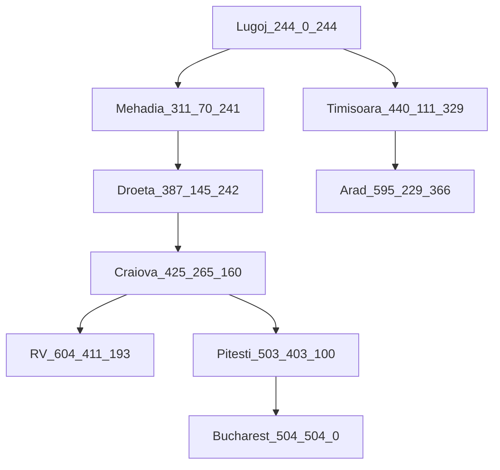

### hw2
#### 4.1

Lugoj-Mehadia-Timisoara-Droeta-Craiova-RV-Pitesti-Arad-Bucharest

#### 4.2
w的取值为1时，为A* 搜索，具有最优性(树搜索情况下)，图搜索要求h一致
当 $w=0$ 时，这个算法是贪婪搜索。当 $w=1$ 时，这个算法是A*搜索。当 $w=2$ 时，这个算法是迭代加深搜索。

#### 4.6
1. 启发函数 h(n) = 2 * 直接移动到目标状位置的移动步数
2. 例如在达成目标前的几步，假设目标状态是： 
```
1  2  3
4  5  6
7  8  _
```

现在的状态是：

```
1  2  3
4  _  6
7  5  8
```

使用 $h'(n)$ 估计的代价是 $2*2=4$ 。然而，最优解只需要两步，A*算法在使用 $h'(n)$ 作为启发性函数时，可能会找到一个非最优的解决路径。
3. 证明如下：
假设 $h^*(n)$ 是启发函数的理想值，也就是 $n$ 到目标节点的最短路径
因为 $h(n) \leq h^*(n) + c$ ，设 $n'$ 是 A* 算法选择的解，$n^*$ 是最优解，那么对任意节点 $f(n') = g(n') + h(n') \leq f(n^*) = g(n^*) + h(n^*)$
由 $h(n') = h^*(n') \leq h(n^*) + c = h^*(n^*) + c$，所以 $g(n') = f(n') - h(n') \leq g(n^*) + h^*(n^*) - h^*(n') + c = g(n^*) + c$。
得证，A* 算法的选择的解的代价不会比最优解的代价多 $c$。 


#### 4.7
1. 由一致性可知，对于每一对节点 $n$ 和 $g$ 来说，实际从 $n$ 到 $g$ 的成本不小于从 $n$ 到 $g$ 的估计成本与从节点 $g$ 到目标的启发成本之和，即 $c(n,g) \geq h(n) - h(g)$ ，其中 $c(n,g)$ 是从 $n$ 到 $g$ 的实际成本
等式可变为 $h(n) \leq c(n,g) + h(g)$，由于目标节点到自身的启发式函数值 $h(g)$ 为 0 ，所以有 $h(n) \leq c(n,g)$ 。这就证明了如果启发式函数满足一致性，那么它就不会高估从任何节点到目标的成本，即它是可采纳的。

1. 在全连接的图中，假设每条边的代价都是正值。
启发函数 $h(n)$ 定义为，如果 $n$ 是目标节点，那么 $h(n) = 0$。否则 $h(n)$ 是稍微小于到目标的最小代价的值。因此，启发式函数不会高估从任何节点 $n$ 到目标的实际成本，即是可采纳的。
但是在满足条件 $c(n,m) \geq h(n) - h(m)$ 的同时，对于任意的非目标节点 $g$ 和目标节点 $n$，我们会有 $c(g,n) < h(g) - 0 = h(g)$ ，显然不一致。
