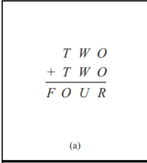
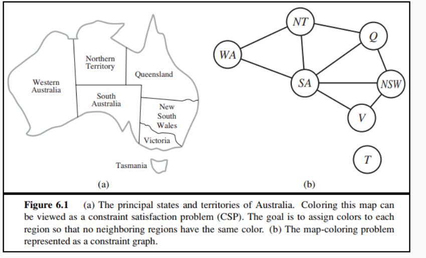

### 6.5 同时用带有前向检验、MRV和最少约束值启发式的回溯算法手工求解图6.2中的密码算数问题。

F=1
|F|T|W|O|U|R|
|---|---|---|---|---|---|
|1|5-9|||||
|1|9||7 8|1 3 5 7 9|4 6|
|1|9|5-9|7|1 3 5 7 9|4
|1|9|0-4|8|1 3 5 7 9|6
|1|8||5 6||0 2|
|1|8|5-9|5|1 3 5 7 9|0|
|1|8|0-4|6|1 3 5 7 9|2
|1|7||3 4||6 8
|1|7|5-9|3|0 2 4 6 8|6
|1|7|0-4|4|0 2 4 6 8|8
1|6||1 2||0 2
1|6|5-9|1|0 2 4 6 8|2
1|6|0-4|2|0 2 4 6 8|4
1|5|0-4|0|0 2 4 6 8|0

### 6.11

WA = green V = red
(w,s)=>$D_S={blue, red}$
(v,s)=>$D_S={blue}$
(w,nt) (s,nt) =>$D_Nt={red}$
(v,nsw) (s,nsw)=>$D_Nsw={green}$
(s,q) (nt,q) (nsw,q) =>$D_Q={NULL}$

### 6.12
由于检验一条弧的时间复杂度为$O(d^2)$,假设树有n个节点，则有n-1条弧，故最坏时间复杂度为$O(2(n-1)d^2)$=$O(nd^2)$