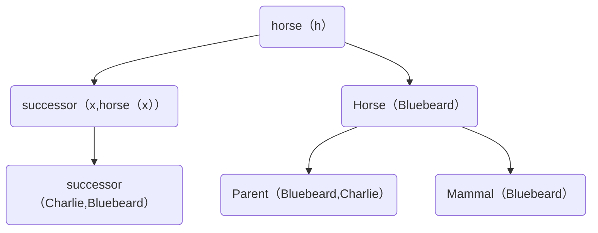

### 8.24
#### def
takecoures(x,s,c) 学生x在学期s上c课
pass(s,c) 学生s通过课程c考试
bestgrad(c,g) 课程c的最好成绩是g 
insurence(x) x买了保险
smart(x) x聪明
expansiveinsurence(x) x买了昂贵的保险
sellinsurence(x,y) x向y卖保险
shave(x,y) x给y刮胡子
selfshaved(x) x自己刮胡子
bornineng(x) x在英国出生
UK(x) x是英国公民
perment(y) y英国永居
parent(x,y) x是y父母
politician(x) x是政治家
fool(x,y,t) x在t时刻愚弄y
#### a
$\exist t \; takecoures(t,2001spring,france)$
#### b
$\forall t \forall s \; Student(t,s,france)\rightarrow pass(s)$
#### c
$\exist x \; takecoures(x,2001spring,greek) \bigwedge \neg \exist y\; takecoures(y,2001spring,greek) \bigwedge y \neq x$
#### d
$\forall x,y,g_1,g_2\; takecourse(x,greek,s)\bigwedge takecourse(y,france,s)\bigwedge bestgrade(greek,g_1)\bigwedge bestgrade(france,g_2) \bigwedge g_1>g_2$
#### e
$\forall x\;insurence(x) \rightarrow smart(x)$
#### f
$\neg \exist x \; expansiveinsurence(x)x$
#### g
$\exist x,y\; sellinsurence(x,y)\rightarrow \neg insurence(y)$
#### h
$\exist x,y\; shave(x,y)\rightarrow \neg selfshaved(y)$
#### i
$\forall x(borineng(x)->(UK(x)\bigwedge(\forall y parent(x,y)->(UK(y)\bigvee perment(y)))))$
#### j
$\forall x(\neg bornineng(x)->(\exist y(bornineng(y)\bigwedge parent(y,x)\bigwedge(\forall z (parent(y,z)->UK(z))))))$
#### k
$\forall xpolitician(x)->(\neg\exist t,y fool(x,t,y))$

### 8.17
对于右上角的格子不成立

### 9.3
b
### 9.4
#### a
{x/A,y/B,z/y}
#### b
{x/y,y/G(A,B)}
#### c
{y/john,x/y}
#### d
不存在

### 9.6
#### a
$\forall x(manual(x)\rightarrow(horse(x)\bigvee cow(x) \bigvee pig(x)))$
#### b
$\forall x(horse(successor(x,horse(x)))\rightarrow horse(x))$
#### c
$horse(blueberd)$
#### d
$parent(CHarlie,Blueberd)$
#### e
$\forall x,y \;successor(x,y)\rightarrow parent(y,x)$
#### f
$\forall x\exist y(manual(x)->parent(y,x))$

### 9.13
#### a

#### b
每个哺乳动物都有一个家长，并且后代与家长是逆关系
#### c
Bluebeard,Charlie