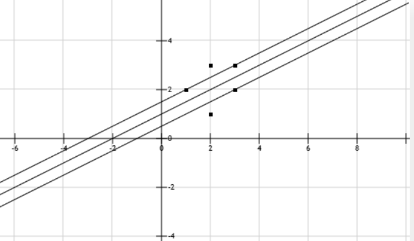
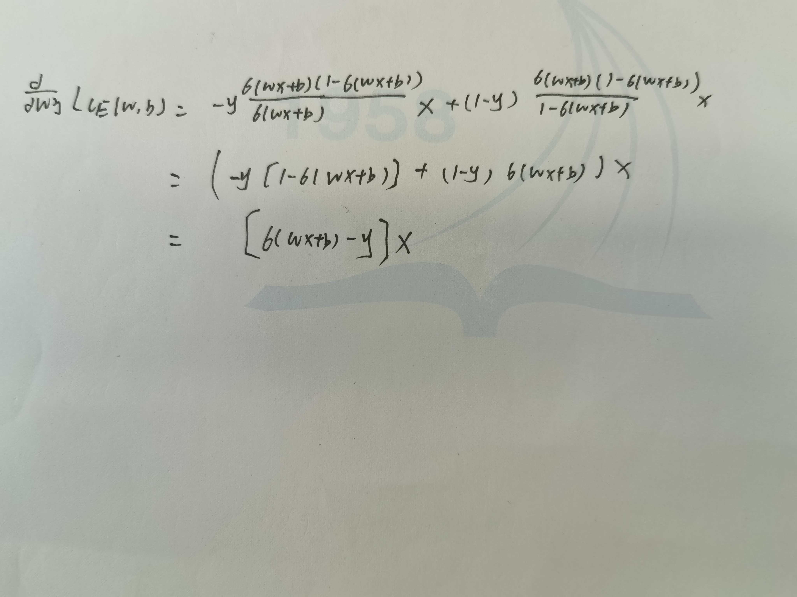

#### 试证明对于不含冲突数据集（即特征向量完全相同但标记不同）的训练集，必存在与训练集一致（即训练误差为 0）的决策树
> 反证法：假设不存在与训练集一致的决策树，即对于相同属性集，存在错误目标值，那么对于训练出来的决策树至少有一个节点无法划分数据，即存在冲突数据。这与题设不含冲突数据矛盾，因此一定存在与训练集一致的决策树

#### 最小二乘学习方法
1. 使用该规范项而不是L2规范的区别在于其中的D，由于是部分数据的误差较大，可以通过调整$D_i$来针对部分数据特征做调整，该值越大，说明对应项误差越大,最后起的作用越小
2. 
$$
\min_w\left(|Xw-y|^2+\lambda w^TDw\right)
$$

对$w$求导，令导数为0，可得：
$$
X^TXw - X^Ty+\lambda D w=0 \\
w^*=(X^TX+\lambda D)^{-1}X^Ty
$$

#### 假设有 n 个数据点
   1. 证明k是对称矩阵，即证$k(x_i,x_j)=k(x_j,x_i), \phi(x_i)\phi(x_j)=\phi(x_j)\phi(x_i)$显然相等
   2. 将不等式左侧展开，可得$(z_{1}^2k_{11}+z_{1}z_{2}k_{12}+......,z_{1}z_{2}k_{12}+z_2^2k_{22}...,...,z_nz_1k_{n1}+...)$之后将k按照题设展开，可得$\sum_{i=1}^{n}\sum_{j=1}^{n}z_i\phi(x_i)z_j\phi(x_j)=(\sum_{i=1}^{n}z_i\phi(x_i))^2\geq 0$

#### 最大间隔分离超平面和分类决策函数
1. 假设超平面参数为$w_1,w_2,b$对于所有点列公式，得到方程组
$\begin{array}{l}\quad \mathrm{w}_{1}+2 \mathrm{w}_{2}+\mathrm{b} \geq 1  \\ 2 \mathrm{w}_{1}+3 \mathrm{w}_{2}+\mathrm{b} \geq 1 \\ 3 \mathrm{w}_{1}+3 \mathrm{w}_{2}+\mathrm{b} \geq 1  \\ -2 \mathrm{w}_{1}-\mathrm{w}_{2}-\mathrm{b} \geq 1  \\ -3 \mathrm{w}_{1}-2 \mathrm{w}_{2}-\mathrm{b} \geq 1 \end{array}$
发现$w_1^2+w_2^2$最小是在$w_1 = − 1 , w_2 = 2$将这个值带入原来的方程，可以得到b = − 2。 $-x_1+2x_2-2=0$
2. 图像

支持向量
(1,2)(3,3)(3,2)

#### 损失函数求导

#### kmeans算法收敛性讨论
> 一定收敛，现在证明如下：
> 设聚类中心为${t_1,t_2,...t_k}$,由此划分的聚类为{T_1,T_2,...T_k}.F(T)为所有节点到其对应的聚类中心的距离和，且F(T)>0.
> 下证F(T)的单调性：
> 每一次迭代分为两步，更新节点，之后将每个节点移动到距离自己最近的中心节点的聚类中。对于第二步，一定是递减的。那么只需要证明第一步一定不会使得F(T)增加即可，即证：对于一个聚类，f(ti)取最小值时，一定是$t_i$为中心点时。
> 有$\sum_{i=1}^{k}{(x_i-t_i)^T(x_i-t_i)}$，对x求导，有$2\sum(x_i-x)=0$，故得出结论，最小值为聚类中心取在中心点处，因此单调性得证，进而有单调有界得知该函数收敛