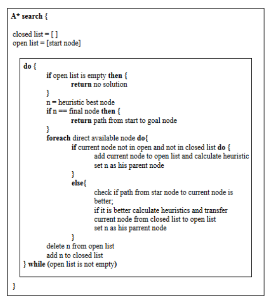
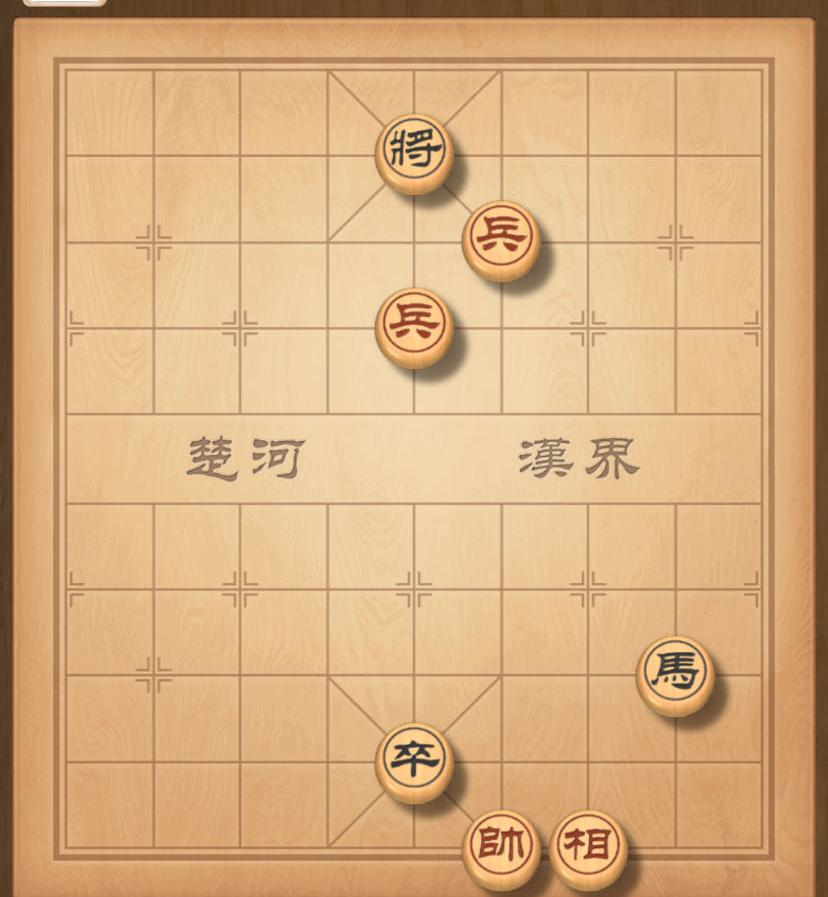

### lab1
#### Astar
1. 启发式函数
采用曼哈顿距离作为启发式函数
定义启发式函数 \( h(n) \)，设 \( (x_1, y_1) \) 为当前位置坐标，\( (x_2, y_2) \) 为科考站位置坐标，则曼哈顿距离为：
\[ h(n) = |x_1 - x_2| + |y_1 - y_2| \]
> 现在来证明这个启发式函数是 admissible 的。由距离非负有 \( h(n) \geq 0 \)
针对题设条件，假设到达目标位置的路上不需要绕路，即在路线上没有1类型，且食物充足，那么所需天数最少 \( |x - x_2| + |y - y_2| \)
由于曼哈顿距离是 \( |x - x_2| + |y - y_2| \) 的一个下界，所以 \( h(n) \) 是 admissible 的。

接下来讨论启发式函数是否满足 consistent 性质。

一个启发式函数 \( h(n) \) 满足 consistent 性质，如果对于任意相邻的状态 \( n \) 和 \( n' \)，有：
\[ h(n) \leq c(n, n') + h(n') \]
> 在此题中 \( c(n, n') \) 恒为 1。因此，我们只需证明 \( h(n) \leq 1 + h(n') \)。
不妨设 \( n' \) 是通过向右移动得到的，则 \( (x_1', y_1') = (x_1 + 1, y_1) \)。
那么\[ h(n') = |(x_1 + 1) - x_2| + |y_1 - y_2| = |x_1 - x_2| + 1 \]
\[ h(n) = |x_1 - x_2| + |y_1 - y_2| \leq 1 + |x_1 - x_2| = 1 + h(n') \]
因此，这个启发式函数满足 consistent 性质。

2. 算法主要思路
根据PPT上的算法加以改造，在对节点的定义中加入食物的定义，之后在遍历图的时候，若遇到是2，则食物数恢复到T，否则减1，若为0，则说明这条路无法继续。
对于在list中的判断，要依据对应的节点的位置来判断这个节点是否已经访问过了。

3. 与一致代价搜索作比较
对于前面几个样例，相较于一致代价搜索，启发式的效果并不明显，因为图较小，即使减少了部分搜索，也会与启发函数计算时间相抵消。不过对于最后一个样例，如果不添加启发式函数，时间会变得特别长。因为我的代码在判断一个节点是否可以访问时添加了food如果比之前访问的大，就可以继续访问。这样会导致同一节点会被搜索多次，导致时间无比长，而添加启发式函数后只需不到20s即可跑完。

### alphabeta
#### 算法实现过程
1. 设定搜索深度为4，建立对应的节点树
2. 计算各个节点的得分
3. 运行剪枝算法，维护$\alpha-\beta$的值，遍历孩子节点并剪枝
4. 找到最优解，输出
#### 分析alpha-beta剪枝对搜索效率的影响
有剪枝所需时间为73.8050073s
将剪枝代码注释掉
无剪枝所需时间为82.2091416s
大约有13%的效率提升，由于
#### 评估函数的设计思路
得分主要包括两个部分：棋子价值，棋子所在位置的价值。其中相关数据框架已经给出
只需遍历pieces，求和，并用红色的得分减去黑色的即为总分
#### 实验效果
取得了较好的结果，比如

计算结果为右侧兵挺近一，可以逼迫敌方将后移而且由于不能对将，无法吃掉我方卒。
