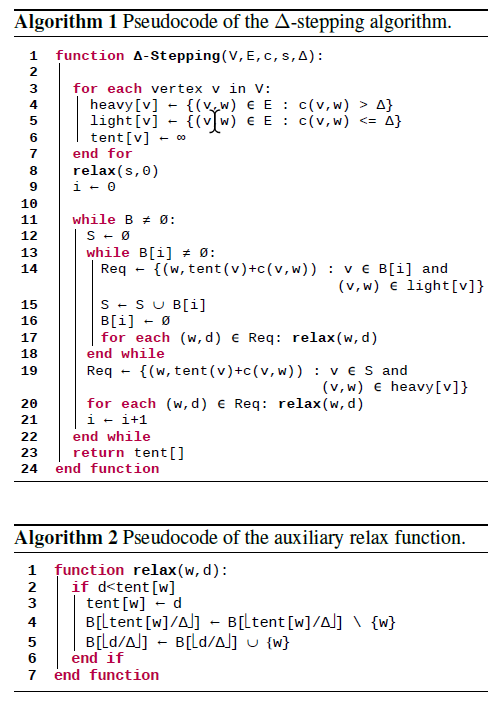

## 并行计算实验报告
### 1. 矩阵分解
#### 算法设计
1. 问题分析
   1. 并行化部分
   串行算法中的对于上下三角矩阵的计算

            for k = 1 to n:
                for i = k + 1 to n:
                    A[i][k] = A[i][k]/A[k][k]
                for i = k + 1 to n:
                    for j = k + 1 to n:
                        A[i][j] = A[i][j] - A[i][k] * A[k][j]
    两个for循环都可以做并行
    2. 串行部分
    输入输出部分无法并行
    3. 负载划分
    无法严格均匀划分，因为对于每一列的计算，计算量逐个减少，但是可以使得负载尽量均匀的划分。
 2. PCMA
    1. 划分(Partitioning)：
    对于矩阵分解任务，做静态调度，对于这两个循环都进行划分
    划分依据为按照列进行划分。

            #pragma omp parallel for schedule(static)
            for i = k+1 to N-1
                A[i * N + k] /= Akk
            #pragma omp parallel for schedule(static)
            for i = k+1 to N-1
                for j = k+1 to N-1
                    A[i * N + j] -= A[i * N + k] * A[k * N + j]
    2. 通讯
    对于内存中A数组的访问需要等待其余进程访问结束才可以访问
    3. 组合：无
    4. 映射：每一列的计算映射到一个处理器上

#### 实验结果
对于可扩放性的实验结果
1. 串行：
总时间7s
2. 2线程：
总时间5.6s
1. 4线程
总时间5.3s

1. 6线程
总时间5.8s
可扩放性效果不好，说明程序中的并行部分占比较少

#### 结论
在openmp编程中，对于线程数的设置很重要，并且不是线程越多，算法运行时间越短

### 2. 单源最短路径问题
#### 问题分析
1. 采用delta-stepping算法
   
2. 并行描述
    途中可并行的部分主要有算法中取出节点形成Req数组、对它们松弛的操作。

#### 算法分析
1. 算法设计
找到第一个非空的桶，找到其中顶点对应的轻边做relax操作。若桶非空，则再次执行第一步
当桶空后，找到之被操作过的顶点，找到其对应的重边，进行relax，之后对下一个非空桶操作
2. 并行设计
    1. 在对REQ中的节点做松弛操作时可以对里面的元素做并行松弛
    2. 向REQ中添加S中的操作，相当于图中的19行
    3. 向REQ中添加轻边的过程，相当于途中的14行

#### 实验结果
| 线程数 | 时间 |
| ------ | ---- |
| 1      | 16s  |
| 2      | 17   |
| 4      | 20s  |
| 8      | 21s  |
#### 总结
现成增加导致运行结果运行结果上升，推测是每次并行地松弛时，都需要阻塞操作来保证数据一致性，导致通信的开销比较大，进而影响并行性能。当程序串行执行，且桶的数量很多是，算法的效果最好。并行的可扩放性不好，部分原因是算法本身的设计对并行的支持度不太好，但也胜过迪杰斯特拉算法。

### 3. K-means
#### 算法设计
1. 问题分析
算法本身的思路是每次更新聚类中心为当前聚类的路径中心，使得总距离每次迭代都减小
2. 并行分析
算法的主要部分为在k次迭代中,每一次要更新所有聚类的中心,而这需要计算当前聚类的几何中心.对于每一个节点要计算它属于哪个聚类中心,可以为每一个进程分配固定数目的节点,分别计算它们属于哪个聚类
3. 通信
由主线程做初始化操作并把聚类中心广播到所有的线程中.
每一个线程计算几何中心之后聚集传递到主线程,更新聚类节点之后做新的循环
4. 空等分析
在主线程更新聚类中心时,其他线程只能空等
5. 可能改进
在主线程更新聚类中心操作存在可以并行的部分,即计算聚类几何中心,这部分感觉用openmp效果比较好,但是不知道OJ是否支持就没有尝试
#### 实验结果
由于无法再代码层面指定进程数目,因此采用本机测试的方式,采用time指令的real指标测量具体时间
|进程|时间|
|---|---|
1|0.434
2|0.359
3|1.86
4|2.17
8|2.9

总结:发现程序在多进程并行结果并不好,可能是因为数据的规模太小，因此进程间通信所消耗的时间远远大于并行计算节省的时间.导致并行结果不明显

### 4. 稀疏矩阵乘法
#### 算法设计
1. 问题分析
   1. 并行部分分析
   对于矩阵乘法，假设得到的结果为M*N的矩阵，那么每一个元素的计算都不互相依赖，即可以并行的。
   2. 空等分析
   由于是稀疏矩阵，所以可能存在一整列都为0的情况，在这种情况下结果矩阵的对应列都为0，对应的处理器会进行空等
   3. 负载划分
   无法均衡划分，因为不知道具体的稀疏矩阵上元素的分布
   4. 并行开销
   需要把矩阵信息传输到GPU上，在计算之后还需要将结果传输到本机
2. 算法描述
    1. 任务划分
    按照结果矩阵的每一个元素的计算进行划分
    2. 存储方式
    对于常规矩阵的存储采用一维数组，对于稀疏矩阵的存储采用CSR的方式存储，存储值，行号，列的第一个元素对应的值数组下标。
    3. 计算结果
    如果这一列的稀疏矩阵不为空，则按照矩阵乘法计算对应位置的元素值

            for (int k = first_index; k < first_index + num; k++)
                {
                    int s_row = rows[k];
                    int s_val = values[k];
                    sum += D[row * N + s_row] * s_val;
                }
    4. 通信
    采用cudaMemcpy函数在主机与GPU之间的参数传输，例如

             cudaMemcpy(d_D, h_D, sizeof(int) * M * N,   cudaMemcpyHostToDevice);
    
#### 实验结果
由于使用每一个处理器计算每个输出矩阵的元素,理论上达到最大的并行程度,且程序设计本身无法修改并行程度.所以只能提供OJ运算的时间:3.5s