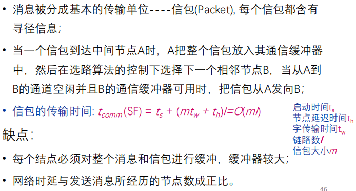
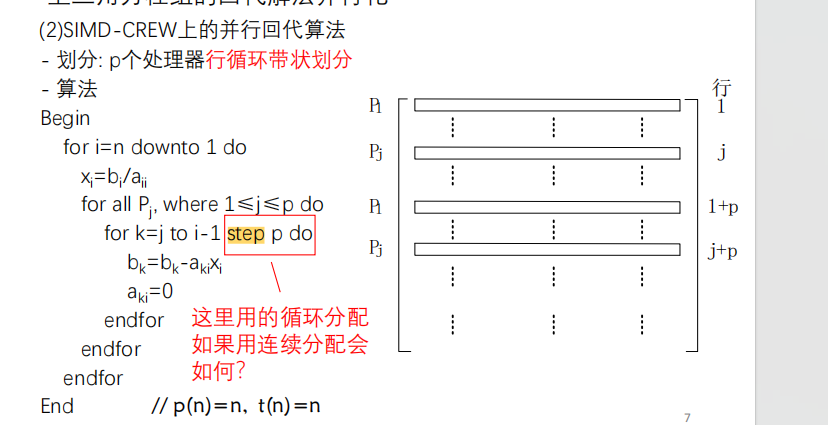
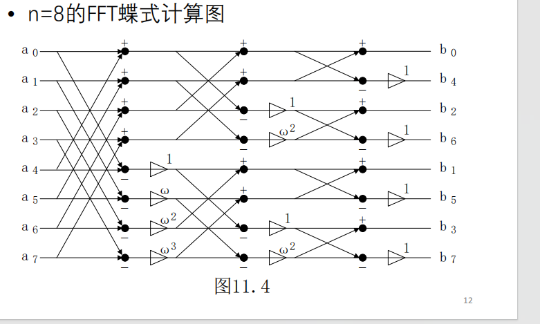

## 并⾏计算与并⾏计算机结构模型
### 并⾏计算机体系结构
1.  并⾏计算机结构模型
   SISD 串行， MIMD，SIMD 并行
   SIMD：在SIMD模型中，所有处理器同时执行相同的指令，但是操作不同的数据。这种模型适用于数据并行计算，其中相同的操作需要同时应用于多个数据元素。例如，向量运算就适合使用SIMD模型。

    MIMD：在MIMD模型中，每个处理器可以独立执行不同的指令，处理不同的数据。这种模型适用于任务并行计算，其中不同的操作需要同时进行，但是数据集合不同。例如，分布式系统中的多个独立节点并行执行不同的任务就是MIMD模型的一个例子。

## 并行机系统互连与基本通信操作
### 并行计算机互连网络
#### 系统互连
1. 不同带宽与距离的互连技术: 总线、SAN、LAN、MAN、WAN
2. 网络特征指标
• 节点度（Node Degree）：射入或射出一个节点的边数。
在单向网络中，入射和出射边之和称为节点度。
• 网络直径（Network Diameter）： 网络中任何两个节点
之间的最短距离的最大值。
• 对剖宽度（Bisection Width） ：对分网络各半所必须移
去的最少边数。
• 对剖带宽（ Bisection Bandwidth）:每秒钟内，在最小的
对剖面上通过所有连线的最大信息位（或字节）数。
• 如果从任一节点观察网络都一样，则称网络为对称的
（Symmetrical）
3. • 静态互连网络：处理单元间有着固定连接的一类网络，
在程序执行期间，这种点到点的链接保持不变；典型的
静态网络有一维线性阵列、二维网孔、树连接、超立方
网络、立方环、洗牌交换网、蝶形网络等。
• 动态网络：用交换开关构成的，可按应用程序的要求动
态地改变连接组态；典型的动态网络包括总线、交叉开
关和多级互连网络等。
4. 静态互联
   1. 一维线性阵列
    每个节点只与其左、右近邻相连，也叫二近邻连接。
    • N个节点用N-1条边串接，内节点度为2，直径为N-1，对剖宽度
    为1。
    • 当首、尾节点相连时可构成循环移位器，在拓扑结构上等同于
    环，环可以是单向的或双向的，其节点度恒为2，直径为 N/2
    （双向环）或N-1（单向环），对剖宽度为2 。
    2. $\sqrt N * \sqrt N$二维网孔
        
    3. 二叉树
    • 除了根、叶节点，每个内节点只与其父节点和两个子节点相连。
    • 节点度为3，对剖宽度为1，而树的直径为2( log𝑁（上界） − 1)
    • 如果尽量增大节点度数，则直径缩小为2，此时就变成了星形网络，
    其对剖宽度为 𝑁/2 （下界）
    • 传统二叉树的主要问题是根易成为通信瓶颈。胖树节点间的通路
    自叶向根逐渐变宽
    4. 超立方
    
5. 嵌入
• 环网可完美嵌入到2-D环绕网中
• 超立方网可完美嵌入到2-D环绕网中
6. 动态互联
    • 交换开关模块：
        • 一个交换开关模块有n个输入和n个输出，每个输入可连接到任意输出
        端口，但只允许一对一或一对多的映射，不允许多对一的映射，因为
        这将发生输出冲突
    • 级间互连（Interstage Connection ）：
        • 均匀洗牌、蝶网、多路均匀洗牌、交叉开关、立方连接
        • n输入的Ω网络（均匀洗牌）需要log2𝑛𝑛 级 2 × 2开关
7. 互联函数
   1. 恒等互联：直接映射
   2. 交换函数：二进制地址编码中第k位互反的输入端与输出端之间的连接
   3. 均匀洗牌函数：输入端的二进制编号循环左移一位
   4. 蝶式函数：输入端的二进制编号的最高位与最低位互换位置，便得到了输出
端的编号
    
    5. 反位序函数：输入端二进制编号的位序颠倒过来求得相应输出端的编号
    6. 移数函数：将各输入端都错开一定的位置（模N）后连接到输出端
    7. PM2I函数：将各输入端都错开一定的位置（模N）然后连接到输出端
### 不用记公式
#### 选路方法与开关技术

1. 选路方法
   1. X-Y选路算法
   2. E-立方选路算法：原地址到目的地址从最后一位开始，逐位改变

2. 开关技术 SF与CT
   1. 存储转发(Store-and-Forward)选路 
   
   2. 切通(Cut Through)选路
   
   链路上的节点延迟时间不可避免，但是传输时间可以减少
#### 单一信包一到一传输
1. 
#### 一到多播送
1. SF
   1. 环
   • 步骤： ①先左右邻近传送;②再左右二个方向同时播送
   2. 环绕网孔
   • 步骤：①先完成一行的播送;②同时进行各列的播送
   3. 超立方
    • 步骤：从低维到高维，依次进行播送
2. CT
   1. 环
   • 步骤
    (1)先发送至p/2远的处理器;
    (2)再同时发送至p/22远的处理器;
    ……
    (i)再同时发送至p/2i
    远的处理器
    2. 环绕网孔
    • 步骤：
    (1)先进行行播送
    (2)再同时进行列播送
    3. 超立方
    • 步骤：从低维到高维，依次进行播送
#### 多到多播送
1. SF
   1. 环
   • 步骤：
    同时向右(或左)播送
    刚接收到的信包
    2. 环绕网孔
     步骤：
    (1)先进行行的播送；
    (2)再进行列的播送
    3. 超立方
    • 步骤：
    依次按维进行
    多到多的播送
2.  CT等同SF
   
## 典型并行计算机系统介绍
### 共享存储多处理机系统
#### ......

## 并行计算性能评测
### 并行机的一些基本性能指标
#### 通信开销
1. 点到点

### 加速比性能定律
#### Amdahl定律

串行时间除以并行时间
#### Gustafson定律

相同时间并行工作量除以串行工作量
#### Sun-Ni定律

### 可扩放性评测标准
> 可扩放性最简朴的含意是在确定的应用背景下，计算机系统（或算法
或程序等）性能随处理器数的增加而按比例提高的能力
#### 等效率度量标准

#### 等速度

#### 平均延迟

 可扩放性：随着处理器个数p增加，为了按照某个标准
保持并行性能，问题规模W需要相应地增加。
 需要增加的W越少，说明可扩放性越好
 三个典型的标准：
 等效率：保持效率E=加速比S/处理器个数p不变
 等速度：保持单个处理器平均速度不变
 平均延迟：保持效率E不变，但通过W和p调整前后的平均延迟
比值衡量

## 并行算法与并行计算模型
### 并行算法的复杂性度量
 运行时间t(n): 包含计算时间和通讯时间，分
别用计算时间步和选路时间步作单位。n为问
题实例的输入规模。
 处理器数p(n)
 并行算法成本c(n): c(n)=t(n)p(n)
 成本最优性：若c(n)等于在最坏情形下串行算
法所需要的时间，则并行算法是成本最优的。
 总运算量W(n): 并行算法求解问题时所完成的
总的操作步数
#### Brent定理 

### 并行计算模型
#### PRAM模型
 优点
 适合并行算法表示和复杂性分析，易于使用
 隐藏了并行机的通讯、同步等细节
 易于设计算法，适量修改可运行在实际的并行机上
 OpenMP (共享内存多核CPU上多线程并行程序)
 CUDA (GPU上的单指令多线程并行程序)
 缺点
 不适合MIMD并行机
 假定每个处理器可在单位时间内访问任何存储单元
 忽略了共享存储器的竞争、通讯延迟等因素
#### 异步PRAM模型

MIMD-SM。
#### BSP
MIMD-DM
#### LOGP
MIMD-DM

## 并行算法基本设计策略
### 串行算法的直接并行化
#### 快排二叉树的并行化
n个数据，n个处理器，每个处理器对应一个数据。并发写，即只有一个处理器能够成功写入。
选择一个主节点root,被选为主节点的处理器直接退出，对于其余节点，若其代表的元素小于主元，尝试将其作为二叉树左节点，反之也是。而由于APRAM-CRCW特性，只有两个（左右节点）可以成功写入，这两个分别作为主元，对应处理器退出算法，其余继续执行。因此算法O($\log{n}$)

### 借用已有算法求解新问题
#### 利用矩阵乘法求所有点对间最短路径

## 并行算法常用设计技术
### 划分设计技术
#### 均匀划分：
将n个元素A[1..n]均匀划分成p段，每个pi
处理A[(i-1)n/p+1..in/p]

#### 方根划分
按照$\sqrt{N}作为大小划分$

#### 对数划分
按照logn大小划分

#### 功能划分技术
n个元素A[1..n]分成等长的p组，每组满足某种特性

### 分治设计技术
### 平衡树设计技术
最大值求解：对于平衡树的每一层自下而上并行求解各个节点的较大值向上传递。

计算前缀和：t(n)=O(logn) , p(n)=n , c(n)=O(nlogn)
前缀和：An=a1+。。。an
通过二叉树向上并行求和，得到每个节点的值，再用这个信息求前缀和

### 倍增设计技术
又称指针跳跃(pointer jumping)技术，当递归调用时，所要处理数据之间的距离逐步加倍，经过k步后即可完成距离为2k的所有数据的计算。
#### 表序问题
t(n)=O(logn) p(n)=n
初始化p[k]和distance[k]
执行 logn次 //O(logn)
(2.1) for all k par-do //O(1)
如果k的后继不等于k的后继之后继，则
(i) distance[k]= distance[k]+ distance[p[k]]
(ii) p[k]=p[p[k]]
(2.2) for all k par-do
rank[k]=distance[k]
#### 求森林的根
t(n)=O(logn) W(n)=O(nlogn)

### 流水线设计技术
Systolic排序算法
一维线性阵列上的心动排序算法
 每个处理器存储自己见过的最小数字
 每个处理器初始存储值为无穷大
 每当从左邻居接收到Y，留下Y和自己存储的Z中的较
小值，将较大值传给右邻居。

## 稠密矩阵运算
### 矩阵的划分
#### 带状划分
按照行或者列均匀划分
#### 棋盘划分
按照方块划分

### 矩阵转置
#### 棋盘划分的矩阵转置
1. 网孔连接 — 情形1: p=$n^2$
下三角的元素：先上移至对
角线，再右移至目的地址
上三角的元素：先下移至对
角线，再左移至目的地址
2. 情形2: p<n2

3. 超立方连接

#### 矩阵-向量乘法
1. 带状划分的矩阵-向量乘法

2. 棋盘划分的矩阵-向量乘法

### 矩阵乘法
空间对准(元素已加载到阵列中）
####  简单并行分块乘法
分成$\sqrt{p}*\sqrt{p}$的块，分别进行行和列的多到多播送，之后每个处理器对自己块内部的所有元素，计算结果

#### Cannon乘法
• 避免多到多播送所有数据
• 通过循环位移，减少存储
对于A的n行，向左移动n步。B的n列，向上移动n步。
对应每个块做内部乘法，加到cij上，之后AB分别左，上移动一块，重复根号p次，将所有的块都算完为止

#### fox
行按照简单一样一对多播送，

#### Systolic乘法

### 线性方程组的求解
####  三角形方程组的求解
1. 上三角方程组的求解
所有行每次减去最后一列，这些行可以并行划分

1. 三对角方程组的求解
   1. 正常求解：
   通过式子相减，依次从上到下消去下对角线上的元素，之后就变成上三角矩阵了
   2. 奇偶规约求解法
   串行算法：利用相邻的两个等式，将其修改为同奇偶的项，如456到357，之后对于奇偶的两组，重新重复上一步骤，直到最后剩下只含2或3变量的方程组，进行求解即可
   
   并行算法
3. 稠密线性方程组的求解
   1. 有回代的高斯消去法：
   先消元化为上三角矩阵，之后回带
   2. 无回代的高斯-约旦法
   消元: 通过初等行变换,将(A,b)化为主对角线矩阵, 记b为A的第n+1列
   3. 迭代求解的高斯-赛德尔法
   将系数矩阵分解为上三角矩阵，对角矩阵，与下三角矩阵
   
4. 稀疏线性方程组的求解
   1. 高斯-赛德尔迭代法的并行化
   
   由于依赖关系如上，每一次红线之间都可以并行执行

## 快速傅里叶变换
### DFT
#### 串行
1. 按照a展开

2. 按照b展开

注意这个结果，偶数是ai+a（i+n/2），对应的蝶式流图也是如此，上半部分偶数都是加

#### 并行FFT算法
1. SIMD-MC2上的FFT算法
二维方阵处理器，边长logn

O$n^{0.5}$
2. SIMD-BF上的FFT算法
按照蝶式流图的样子放置器,然后根据那一位应该是加还是减确定那一位二进制值，加0减1.

logn级
## OpenMP

