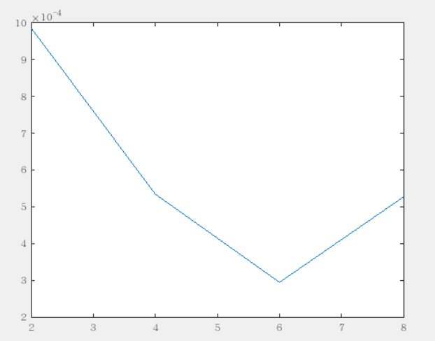
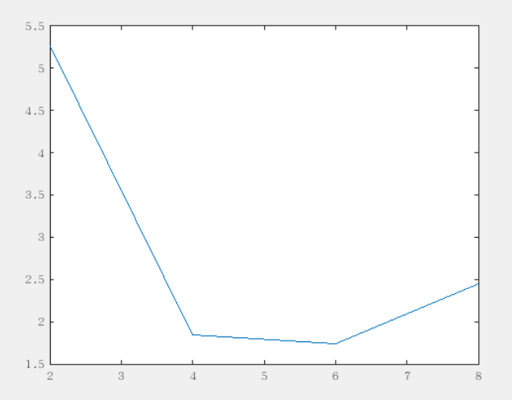
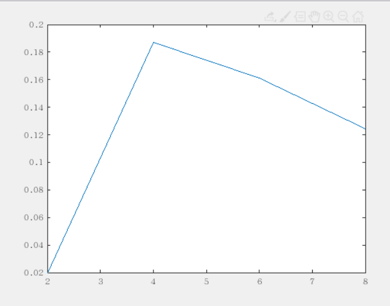
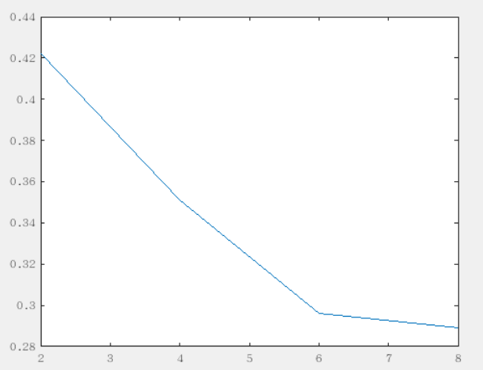

#### 15.3
    for(int i=0; i<10; i++) buff[i]=data[33i];
    MPI_Send(buff, 10, MPI_FLOAT, dest, tag, MPI_COMM_WORLD);
#### 15.13

运行结果为 3.139648，2位有效位数 0.076407 seconds
##### openmp
10^3量级

10^7

##### mpi
10^3

10^7

> mpi的可扩展性更好，因为它能够有效地处理大量的节点和进程，而且通信开销随着进程数量的增加而线性增长较少。OpenMP 的可扩展性受到共享内存的限制，当线程数量增加时，会增加锁和同步操作的开销，导致结果反不如出。