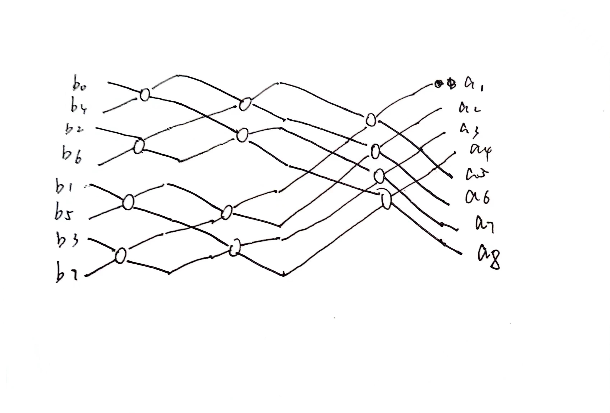

### 10.6
1. n/p
2. $n*(n/p+p + log(p-1) + t_s+4t_w\log{p} +n^2/p)$ 
3. n/p
   
时间复杂度为$O(n^3/p+np+nt_s+4nt_w\log{p})$

### 11.5
傅里叶逆变换SISD

    for k=0 to n-1 do
        c_k = a_k
    endfor

    for h = log n-1 to 0 do
        p= 2^h
        q = n/p
        z = w^-q/2
        for k=0 to n-1 do
            if(k mod p=k mod(2p)) then
                c_k = c_k +c_(k+p)
                c_(k+p) = (c_k-c_(k+p))z^(kmodp)
            endif
        endfor
    endfor
    for k=1 to n-1 do
        b_rk = (1/n)c_k
    endfor  

