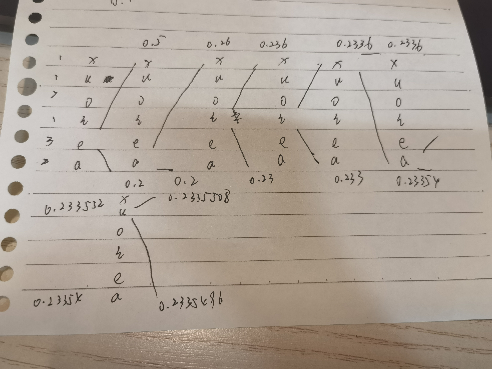

### hw6
#### 1
1. 不能，因为经过均衡化后，各灰度等级出现的概率十分相近，变长编码只对概率不等的才有效
2. 会，因为直方图均衡化后只保证灰度概率相近，而对于图像的二维信息上没有改变
   
#### 2
1. $-\sum_i{p_i}{\log{2}{p_i}}$ = 2.65
2. 
|$S_k$|码|
|---|---|
|S1|10|
|S2|01|
|S0|11|
|S3|001|
S4|0001
S5|00000
S6|000011
S7|000010

长度相同，但是具体表示的码不同
3. 
|$S_k$|码|
|---|---|
|S1|C0
|S2|C1
S0|C1C0
S3|C1C1
S4|C0C1
S5|C0C0
S6|C0C0C0
S7|C0C0C1

4. 
|$S_k$|码
|---|---|
|S1|10
S2|01
S0|00
S3|1100
S4|1101
S5|1110
S6|111100
S7|111101

5.
|$S_k$|码
|---|---|
|S1|10
S2|01
S0|00
S3|111
S4|11001
S5|11010
S6|11000
S7|110111

6.
哈夫曼码 2.7
B1 3.18
2bit二元平移码 2.8
哈夫曼平移码 2.8
都比1中的优，哈夫曼码最佳

#### 3

eaiixiu

#### 4
分为3个位面
0bit位
| 1    | 0    | 0    | 0    | 4    | 4    | 0    | 0    |
| ---- | ---- | ---- | ---- | ---- | ---- | ---- | ---- |
| 1    | 0    | 0    | 7    | 4    | 4    | 0    | 0    |
| 1    | 2    | 0    | 7    | 6    | 5    | 4    | 3    |
| 2    | 2    | 2    | 2    | 6    | 6    | 0    | 0    |

游程编码 1b 7W; 1b 2W 1b 4W; 1b 2W 1b 1W 1b 1W 1b; 0b 8W;

1bit位
| 1    | 0    | 0    | 0    | 0    | 0    | 0    | 0    |
| ---- | ---- | ---- | ---- | ---- | ---- | ---- | ---- |
| 1    | 0    | 0    | 1    | 0    | 0    | 0    | 0    |
| 1    | 0    | 0    | 1    | 0    | 1    | 0    | 1    |
| 0    | 0    | 0    | 0    | 0    | 0    | 0    | 0    |

游程编码 0b 8W; 0b 3W 1b 4W; 0b 1W 1b 1W 2b 2W 1b; 6b 2W;

2bit位
| 0    | 0    | 0    | 0    | 1    | 1    | 0    | 0    |
| ---- | ---- | ---- | ---- | ---- | ---- | ---- | ---- |
| 0    | 0    | 0    | 1    | 1    | 1    | 0    | 0    |
| 0    | 0    | 0    | 1    | 1    | 1    | 1    | 0    |
| 0    | 0    | 0    | 0    | 1    | 1    | 0    | 0    |

游程编码 0b 4W 2b 2W; 0b 3W 3b 2W; 0b 3W 4b 1W; 0b 4W 2b 2W;
最大数字为8，故游程编码所需比特数为46*3=138
平均码长138/32=4.3125
对于编码
| 符号 | 概率 |
| --- | --- |
|  0   | 3/8  |
|  1   | 3/32 |
|  2   | 5/32 |
|  3   | 1/32 |
|  4   | 5/32 |
|  5   | 1/32 |
|  6   | 3/32 |
|  7   | 1/16 |

信息熵为$-\sum_{i} p_i\log_{2}{p_i} = 2.57$ ，编码效率为 $2.57/4.3125=59.597\%$
