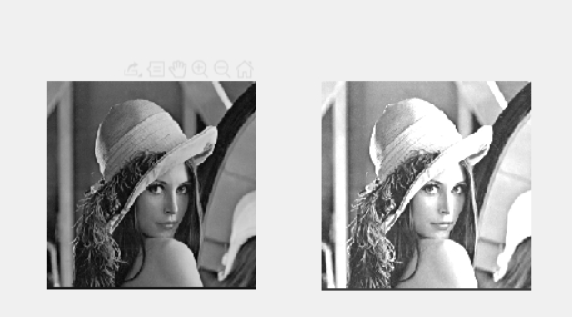
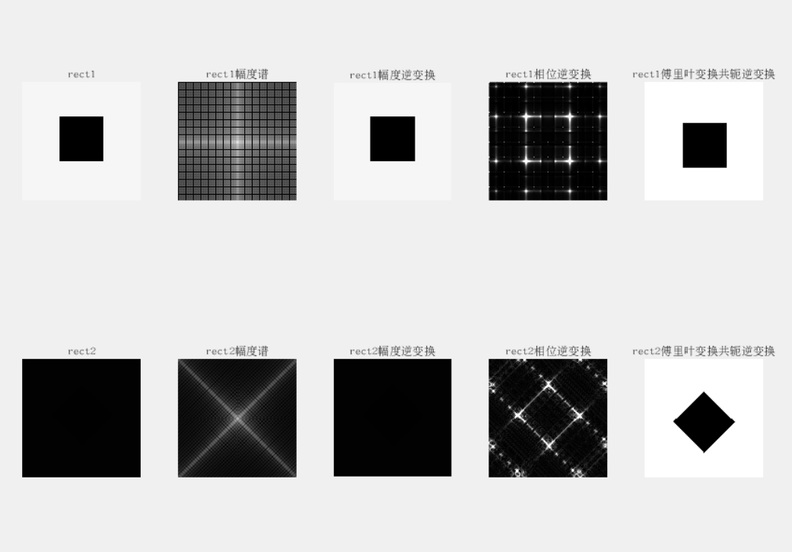
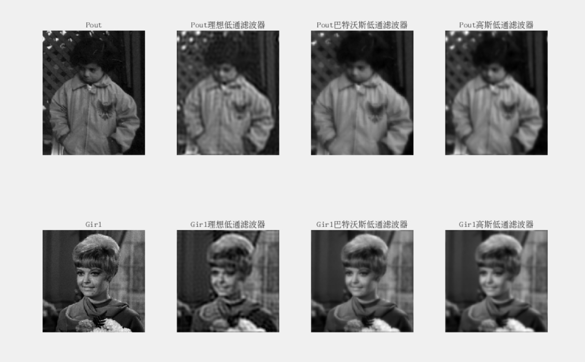

### lab1
#### 1.图像的平移
核心代码
se=translate(strel(1),[x,y])
image2 = imdilate(image1,se)
图像

#### 2.图像的旋转
代码
image3= imrotate(image1,x)
image4 = imrotate(image1,x,'bilinear')
图像

#### 3.图像的缩放
代码
[h,w,c]=size(image1)
image5 = imresize(image1,[h/x,w/y])
image6 = imresize(image1,[h/x,w/y],'bilinear')
图像

#### 4.图像几何失真校正
控制点的选取
cpselect(image8,image7);

矫正失真
% 创建仿射（或投影）转换对象
tform = fitgeotrans(movingPoints,fixedPoints, 'Projective');
选择使用Projective是因为可以将原本平行的线重新映射到平行
% 应用仿射转换
corrected_image8 = imwarp(image8, tform, 'OutputView', imref2d(size(image7)));

### lab2
#### 1线性变换
代码

    output_image = fA * input_image + fB;
实现灰度的线性变换，fA为斜率，fB为截距

    
#### 2灰度拉伸
代码

    output_image(input_image < x1) = y1 * input_image(input_image < x1) / x1;
    output_image((input_image >= x1) & (input_image <= x2)) = (y2 - y1) * (input_image((input_image >= x1) & (input_image <= x2)) - x1) / (x2 - x1) + y1;
    output_image(input_image > x2) = (255 - y2) * (input_image(input_image > x2) - x2) / (255 - x2) + y2;
由于是分段变换，所以需要对于不同范围内的情况做讨论
结果

#### 3灰度直方图
代码

    histogram(input_image);
    axis([lower_x ,upper_x,lower_y ,upper_y]);
histogram创建灰度直方图，通过axis限制上下限
结果 x为[50,200] y小于3000

#### 4.直方图均衡
代码

    output_image = histeq(input_image);
    %均值127 方差30的高斯分布
    output2 = histeq(input_image,normpdf((0:1:255),127,30));
结果

### lab3
#### 创建噪声图像
代码

    pepper = imnoise(source,'salt & pepper',0.03);
    gaussian = imnoise(source,'gaussian');
    random = imnoise(source,'speckle');
分别添加椒盐，高斯，随机噪声

#### 均值滤波
代码

    pepper_output = imfilter(pepper,fspecial('average',3));
应用均值滤波
结果

#### 超限邻域平均法
代码

    function [output] = filter_2(input,T)
        output = input;
        [r,l] = size(output);
        for i = 2 : (r - 1)
            for j = 2 : (l - 1)
                mean_value = mean(mean(input(i - 1 : i + 1, j - 1 : j + 1)));%计算均值
                if(abs(double(input(i,j)) - mean_value) > T)
                    output(i,j) = mean_value;
                end
            end
        end
    end
创建一个超限邻域滤波的函数，首先遍历指定大小方阵内的像素，之后求得平均灰度值，最后对于超出限度的按照均值替代

结果

#### 中值滤波
代码

    pepper_output = medfilt2(pepper);
只需简单调用medflit2函数
结果

#### 超限中值滤波
代码

    function [output] = filter_4(input,T)
        output = input;
        [r,l] = size(output);
        for i = 2 : (r - 1)
            for j = 2 : (l - 1)
                temp = input(i - 1 : i + 1, j - 1 : j + 1);
                middle_value = median(temp(:));
                if(abs(double(input(i,j)) - double(middle_value)) > T)
                    output(i,j) = middle_value;
                end
            end
        end
    end
同样的，对于指定区域，求出中值灰度，之后对于超出范围的，用中值取代
结果

#### 区别
1. 应用均值滤波会使得边缘变得模糊
2. 超限均值对于椒盐噪声处理比较好，因为椒盐噪声与原本的灰度值差距很大，可以被平滑化，而且超限均值可以防止边缘过度平滑
3. 中值滤波能够有效地去除椒盐噪声等离群值，同时保持边缘的清晰度。然而，对于边缘区域的平滑效果相对较差，可能导致边缘轮廓的模糊。
4. 超限中值滤波器在去除离群值的同时，也保留边缘的清晰度。

#### 边缘检测
代码

    %Roberts算子
    Roberts = edge(source,'Roberts');
    %Sobel算子
    Sobel = edge(source,'Sobel');
    %Prewitt算子
    Prewitt = edge(source,'Prewitt');
    %拉普拉斯算子
    Laplacian1 = imfilter(source,fspecial('laplacian',0));
    Laplacian2 = imfilter(source,[-1 -1 -1; -1 8 -1; -1 -1 -1]);
    %Canny算子
    Canny = edge(source,'Canny');
对于拉普拉斯算子，需要手动添加滤波器模版，对于其他算子，可以直接调用函数

结果

### lab4
#### 傅里叶变换
1. 应用傅里叶变换：fft2(source1)
1. 将低频移到中心点：fftshift(F1)
2. 幅度逆变换:ifft2(F1)
3. 相位逆变换：(ifft2(10000*exp(1i*angle(F1)))首先通过angle获取了频域图像 F1 中每个像素点的相位信息。exp(1i*angle(F1)) 则得到了一个具有相位信息、幅度为 1 的复数图像。
4. 共轭变换：ifft2(conj(F1))
结果：

#### 低通滤波
1. 理想滤波：

        function output = ILPF(input,D0)
            [r,l] = size(input);
            F = fftshift(fft2(input));
            [U,V] = meshgrid(-l/2:l/2-1,-r/2:r/2-1);%坐标系构建
            D = hypot(U,V);%频率分量到图像中心的距离
            H = D <= D0 ;
            output = abs(ifft2(ifftshift(F.*H)));%卷积逆变换
        end
2. 巴特沃斯：

        H = 1./(1+((D./D0).^(2*n)));
3. 高斯低通：

        H = exp(-(D./D0).^n);
结果图像：

#### 振铃效应

在灰度变化剧烈的地方会产生震荡
#### 去噪效果

#### 高通滤波
在代码上只有不等号的反向的区分

#### 高频滤波增强
在代码上，对于高通滤波器，添加线性增益
以理想高频增益为例子

    function output = ILPF(input,D0,a,b)
        [r,l] = size(input);
        F = fftshift(fft2(input));
        [U,V] = meshgrid(-l/2:l/2-1,-r/2:r/2-1);
        D = hypot(U,V);
        H = D > D0 ;
        H = a * H + b;
        output = abs(ifft2(ifftshift(F.*H)));
    end
之后调用histeq函数做直方图均衡化
结果如下

### lab5
#### 生运动模糊图像，对其采用逆滤波和维纳滤波进行恢复
1. 运动模糊的产生
代码

        source = im2double(imread('/home/ubuntu/桌面/matlab/image/flower1.jpg'));
        psf = fspecial('motion',30,45);%与图像卷积后逼近相机线性运动的滤波器
        motion = imfilter(source,psf,'conv','circular');%卷积，二维循环展开
        noisy = imnoise(motion,'gauss',0,0.0001);%产生高斯噪声
使用fspecial函数的motion参数生成运动模糊滤波器
之后对于该滤波器做二位展开
2. 逆滤波与维纳滤波
代码

    deconvwnr(motion,psf,0.0001)
使用deconvwnr函数，最后一个参数缺省为0.在没有噪声的情况下，采用缺省值即为理想逆滤波器
3. 高斯模糊情况下
该情况下直接使用逆滤波会受到较大干扰，因此采用维纳滤波可以抑制这种情况

    deconvwnr(noisy,psf,0.0001/var(motion(:)))
正则化参数的值设置为噪声方差的倒数
运行结果

#### 采用大津法（OTSU）自动选取阈值进行分割
1. 使用graythresh函数求取阈值
2. 通过实验手册中的流程计算阈值

代码

    function T = OSTU(input)
        [r, l] = size(input);
        N = r * l;%获得像素点数
        miu = zeros(257);%均值累计矩阵
        w = zeros(257);%概率累计矩阵
        for i = 0 : 255
            p = length(find(input == i)) / N;%像素为i的像素所占比例
            miu(i+2) = miu(i+1) + p * i;
            w(i+2) = w(i+1) + p;
        end
        g = (w./(1-w)).*(miu./w-miu(257)).^2;
        T = (find(g==max(g))- 2)/255;
    end
结果

#### 对图像 cameraman.bmp 采用四叉树表达的迭代区域分裂合并算法进行分割。
1. 分割：S = qtdecomp(source,range_value,2);获取分割
2. 将分割边界设置为255
3. 合并： 

        for j = 1 : i
            bound = boundarymask(blocks==j,4) & (~(blocks==j));
            [r,l] = find(bound==1);
            for k = 1 : size(r,1)
                merge = source((blocks==j) | (blocks==blocks(r(k),l(k))));
                if(range(merge(:))<range_value*256)
                    blocks(blocks==blocks(r(k),l(k))) = j;
                end
            end
        end
    对于相邻块，若是合并后的极差小于给定的值，说明可以合并。
4. 输出合并后的图像
结果
