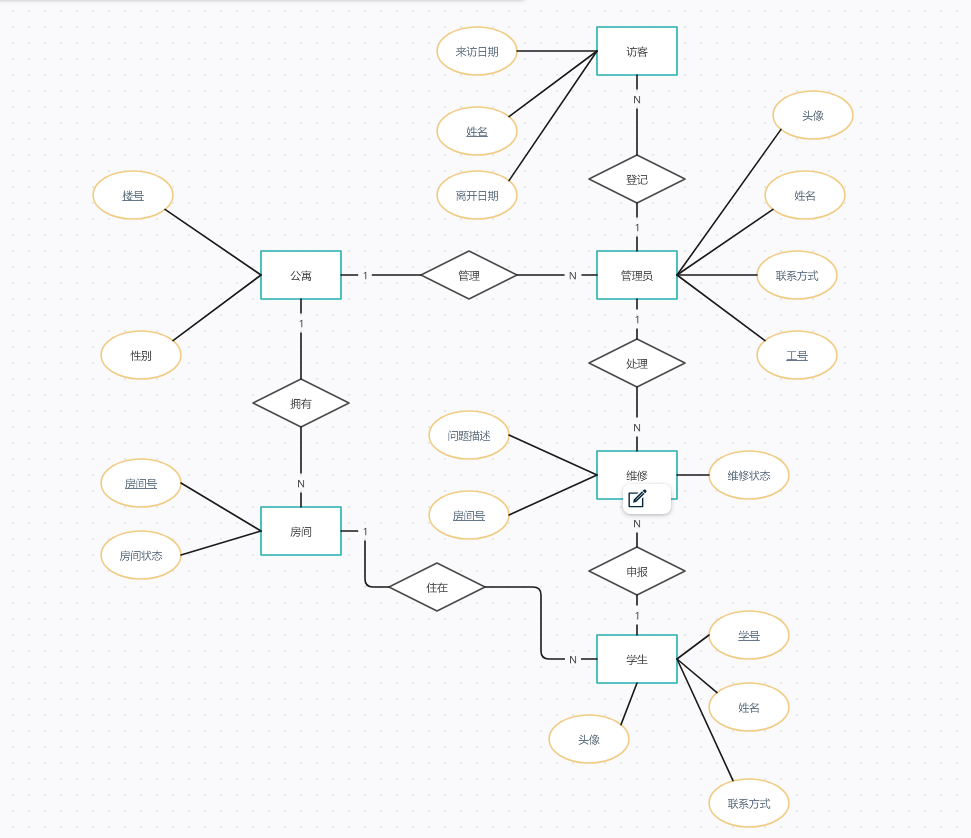

### 选题：学生公寓管理系统
### 需求分析
#### 实体部分
1. 公寓信息管理：
管理员可以查看、新增、编辑和删除公寓的基本信息，包括公寓楼号、地址、可用房间数量、学生性别等。
管理员可以为每个公寓指定一个管理员。

2. 公寓管理员信息管理：
管理员可以查看、新增、编辑和删除公寓管理员的信息，包括姓名、工号、联系方式、头像等。

3. 学生信息管理：
管理员可以查看、新增、编辑和删除学生的信息，包括姓名、学号、联系方式、头像等。
学生信息需要关联到其所属的公寓和房间号。
4. 房间信息管理：
管理员可以查看、新增、编辑和删除公寓的房间信息，包括房间号、房间状态等。

5. 房间维修申报：
学生可以提交房间维修申报，包括描述问题和选择所在房间。
管理员可以查看和处理维修申报，包括分配维修人员、更新维修状态，以及完成维修。

6. 维修状态管理：
管理员可以查看和更新房间的维修状态，包括维修中、已完成等。
7. 访客登记信息管理：
公寓管理员可以登记学生的访客信息，包括访客姓名、来访日期、离开日期、目的房间。
#### 操作部分
1. 学生登录操作：
输入学号，密码
2. 学生注册操作：
输入学号，姓名，密码
1. 管理员登录操作：
输入工号，密码
1. 管理员注册操作：
输入工号，姓名，密码
1. 学生修改信息操作
修改密码，联系方式，上传头像，修改所住房间号
1. 管理员修改信息操作：
修改密码，联系方式，上传头像，修改管理公寓号
7. 学生查看信息操作
   可以查看自身信息
8. 管理员查看信息操作
   可以查看信息，以及查询该公寓楼中的学生信息
9. 学生申报维修操作
    添加申报信息描述，系统根据该学生所在房间自动添加房间信息
10. 管理员处理维修操作
    可以修改维修状态
11. 管理员登记访客信息操作
    管理员登记访客姓名，来访日期，更新离去日期

### er设计
