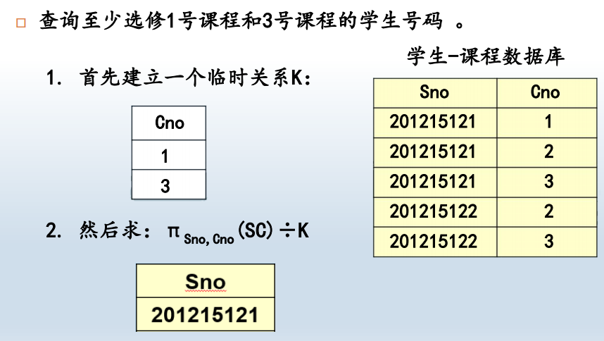
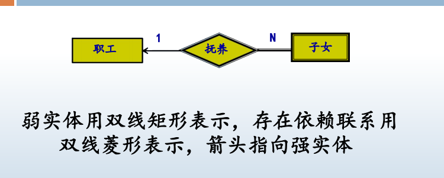
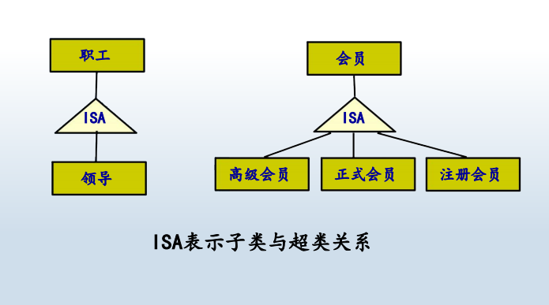

## 1. 数据库系统概述
### 数据
1. 数据与其语义不可分
2. 是数据库中存储的基本对象
### 数据库
#### 定义
> 长期储存在计算机内、有组织的、可共享的大量数据的集合

#### 数据库的基本特征
 持久存储，一般数据量比较大
 数据按一定的数据模型组织、描述和储存
 可为各种用户共享
 数据间联系密切，具有最小的冗余度和较高的独立性
 服务于某个特定的应用

### 数据库管理系统DBMS
是计算机程序的集合，用于创建和维护数据库
### 数据库系统
DBS（DataBase System），指在计算机系统中引入了数据库
后的系统，即采用了数据库技术的计算机系统

### 为什么使用数据库
 数据共享
 减少冗余
 避免不一致
 提供事务支持：如银行转帐
 原子性、一致性、隔离性、持久性
 保持完整性
 增强安全性
 提供并发控制
 标准化

## 数据库系统体系结构
## 数据库系统模式结构
### 数据库模式的概念
1. 类型（Type）和值（Value）
   1. 类型是指对某一类数据的结构和属性的说明
   2. 值是类型的一个具体赋值
2. 模式（Schema）和实例（Instance）
    1. 模式是数据库中全体数据的逻辑结构和特征的描述，它仅仅涉及类型的描述，不涉及具体的值
    2. 模式的一个具体值称为模式的一个实例
    3. 模式——反映数据的结构及联系
        实例——反映的是某一时刻数据库的状态

### 数据库的三级模式结构
外模式,概念模式,内模式
> 外模式是单个用户的视图，概念模式是所有用户的公共数据视图，内模式是数据库内部的存储视图

1. 概念模式
     数据库中全体数据的逻辑结构和特征的描述
     数据记录由哪些数据项构成
     数据项的名字、类型、取值范围
     数据之间的联系、数据的完整性等
     不涉及数据物理存储的细节和硬件环境
     一个数据库只有一个概念模式
     通过模式DDL进行定义
         DDL：Data Definition Language，负责操作模式的数
        据库语言
2. 外模式
 单个用户所看到的局部数据的逻辑结构和特征的描述
 用户与数据库系统的数据接口，对于用户而言，外模式就
是数据库
 建立在概念模式之上，同一模式上可有多个不同的外模式
 外部视图：外模式的实例
 通过外模式DDL进行定义
 模式与外模式的关系：一对多
◼ 外模式通常是模式的子集
◼ 一个数据库可以有多个外模式。反映了不同的用户的应
用需求、看待数据的方式、对数据保密的要求
 外模式与应用的关系：一对多
◼ 同一外模式也可以为某一用户的多个应用系统所使用
◼ 但一个应用程序一般只使用一个外模式
 外模式的用途
 保证数据库安全性的一个有力措施
 每个用户只能看见和访问所对应的外模式中的数据
3. 内模式（存储模式）
 数据物理结构和存储方式的描述
 记录的存储方式：顺序存储、按B树组织还是散列存储？
 索引按什么方式组织：排序、散列？
 数据是否加密？是否压缩存储？
 不涉及物理块（或页）的大小，也不考虑具体设备的柱面
或磁道大小
 一个数据库只有一个内模式
 内部视图：内模式的实例
 通过内模式DDL定义

### 二级映象和数据独立性

# 重点
### 关系代数的除法
给定一个除数B，设属性集为{Y}，拥有若干属性值。要是除以这个B，最后结果就是不包含这个Y的属性的一个表，表项包含x如果x对应的Y中的值包括了B中Y的所有值，类似可以整除的感觉

### 超码、候选码和主码
 超码（Super Key）
 在关系模式中能唯一标识一个元组的属性集称为关系模
式的超码
 候选码（Candidate Key）
 不含多余属性的超码
 包含在某个候选码中的属性称为主属性（Primary 
Attribute）
 不包含在任何一个候选码中的属性称为非主属性（Nonprime Attribute）
 主码（Primary Key）
 用户选作元组标识的一个候选码称为主码，其余的候选
码称为替换码（Alternate Key）
### 参照完整性
外码（Foreign Key）
 关系模式R的外码是它的一个属性集FK，满足：
◼ 存在带有候选码CK的关系模式S，且
◼ R的任一非空FK值都在S的CK中有一个相同的值
 S称为被参照关系（Referenced Relation），R称为参照
关系（Referential Relation）

### sql语言部分
#### DDL 存储数据库模式
1. 表的创建

        Create Table Student(
        S# Varchar(10) Constraint PK Primary Key,
        Sname Varchar(20),
        Age Int,
        Sex Char(1)
        )
2. 定义约束
包括列约束与表约束

        Create Table Student(
        S# Varchar(10) Constraint PK_S Primary Key,
        Sname Varchar(20),
        Age Int Constraint CK_S Check (age>14 and age<100),
        Sex Char(1) ，
        Constraint UQ_S Unique(Sname),
        Constraint CK_SS Check (Sex IN ('M','F'))
        )
    1.  Primary Key约束
    不许有空值，重复
    2. Unique约束
    不允许重复，但可以空
    若约束列中有一列不为空，就实施约束；若约束列都为空，则不实施约束
    3. Foreign Key约束
    外键约束：表中某列值引用其它表的主键列或Unique列，参照完整性含义
    注意使用表约束Constraint FK_SC Foreign Key(S#) References Student(S#)
        1. On Delete Cascade：级联删除，自动删除子表
        2. On Delete Set NULL：级联设空，将子表对应位置设空
    4. check约束
    检查约束：自定义某些列上的约束

            Constraint CK_S1 Check (Age>15)
            Constraint CK_S2 Check (Sex In (’M’,’F’)) 
            Constraint CK_SC Check (Score>=0 and Score<=100) 
            Constraint CK_S3 Check (Sname Is Not NULL)
3. 修改表
   1. 增加列
   alter table <表名>
    Add <列定义>
     <列定义>与Create Table中相同
    2. 删除列
    Alter Table <表名> 
        Drop Column <列名>
    3. 修改列，无法修改列的名字
        Alter Table Student
            Modify age Integer NOT NULL
    4. 重命名列名字
        Alter Table Student
            Rename Column sex To gender
    5. 增加约束
    只能增加表约束
    Alter Table Student
        Add Constraint PK_Student Primary Key(S#)
    6. 删除约束
    按照约束的名字删除
    Alter Table SC
        Drop Constraint FK_SC
    7. 重命名表
    AlterTable SC
        Rename To course_selection
4. 删除基本表
 Drop Table <表名> [Cascade Constraints] 
 Cascade Constraints表示删除表时同时删除该表的所有约束
#### DML 存取数据库数据
1. 插入记录
 Insert Into <表名> (列名1，列名2，……，列名n) 
Values（值1，值2，……，值n）

        Insert Into Student（S#, Sname, Age, Sex）
            Values（’s001’，’John’，21，’M’）
日期数据的插入
InsertInto Student
Values('s004','Rose', 22, 'F','1981/11/08');
2. 修改表中的数据
Update <表名>
    Set <列名1>＝<值1>，<列名2>＝<值2>，
    ……
    Where <条件>
3. 删除表中的记录
Delete From <表名> 
Where <条件>

    Delete From Student
    Where s#='s001'
4. 查询
   1. select
            
            Select <列名表> －－指定希望查看的列
                From <表名列表> －－指定要查询的表
                Where <条件> －－指定查询条件
                Group By <分组列名表> －－指定要分组的列
                Having <条件> －－指定分组的条件
                Order By <排序列名表> －－指定如何排序
    2. 使用别名：查询所有学生的学号和姓名
     Select s# AS 学号, sname AS 姓名 From Student
     如果别名包含空格，须使用双引号
     Select s# AS “Student Number” From Student
    使用表达式：查询所有学生的学号、姓名和出生年份，返
    回两列信息，其中一列是“学号：姓名”， 另一列是出生年份
     Select concat(s#,’:’, sname) AS 学生，2024－age AS 出生
    年份 From Student
    3. 联机视图
         子查询出现在From子句中,可以和其它表一样使用
         查询选修课程数多于2门的学生姓名和课程数
         Select sname, count_c
        From (Select sno, count(cno) as count_c
        From sc
        Group by sno) sc2, student 
        Where sc2.sno=s.sno and count_c>2

#### DCL 数据库控制语言
#### 视图
视图是从一个或几个基本表中导出的虚拟表，其数据没有实际存储，但可以和表一样操作
视图具有和表一样的逻辑结构定义
但视图没有相应的存储文件，而每个表都有相应的存储文件

1. 定义
Create View <视图名>（列名1，列名2，…）
AS <查询>
e.g

        Create View cs_view (sno, name, age) 
        As Select s#, sname, age 
        From student 
        Where Dept=‘计算机系’
#### 补充语法
1. limit
限制返回前多少行
Limit 5,10返回5-10行

2. All，Some，Any
查询工资比sales部门所有人都高的finance部门的员工
 Select eno from employee where dept=‘finance’ and 
salary > 
ALL (select salary from employee where dept=‘sales’)
Some和Any：要求子查询中的某个条件满足即可

### 过程化sql
#### 变量
1. 定义

### 模式分解部分
#### 函数依赖
函数依赖是指一个关系模式中一个属性集和另一个属性集间的多对一关系
#### 最小函数依赖
F的每个FD的右边只有一个属性
 F不可约：F中的每个X→Y，F－{X→Y}与F不等价
 F的每个FD的左部不可约：删除左边的任何一个属性都会使F转变为一个不等价于原来的F的集合

具体过程分为三步
1. 将右边写出单属性并去除重复FD
2. 消去左部冗余属性
3. 消去冗余函数依赖，主要是删除传递依赖

#### 模式分解
1. 1NF
对于关系模式R的任一实例，其元组的每一个属性值都只含有一个值，则R∈1NF
 1NF是关系的基本要求，即表中不能嵌套表
2. 2NF
 （假定R只有一个候选码/主码）当且仅当R属于1NF，且R
的每一个非主属性都完全函数依赖于主码时，R∈2NF
 完全函数依赖：对于函数依赖W→A，若不存在X⊂W，
并且X→A成立，则称W→A为完全函数依赖，否则为局
部函数依赖
 主属性：包含在候选码中的属性
 非主属性：不包含在任何候选码中的属性
3. 3NF
 (假定R只有一个候选码，且该候选码为主码)当且
仅当R属于2NF，且R的每一个非主属性都不传递依赖于主码时，R∈3NF
传递依赖：若Y→X，X→A，并且X→Y，A不是X的子集，则称A传递依赖于Y
4. BCNF
所有完全，不平凡的属性依赖左值都是候选码

5. 保持函数依赖分解到3NF
   1. 求解最小依赖集F
   2. U中删去不在F中出现的属性集合R‘，若F中有x->A，且XA=U,output(U,R')
   3. 将F中左值相同的分为一组，若有一个是另一组的子集，删除，输出$R_1,R_2....$
6. 从上一步退出无损分解到3NF
   1. $\rho=(R_1,R_2..)$ 
   2. x为R的码，$\rho = \rho_1 \cup R''(x)$,去掉$R''(x)若\exist x \in R_i$
7. 分解到BCNF
   1. 若$\rho中所有的关系都满足BCNF,输出$
   2. 否则必定存在 $x->A$,且x不是候选码,设$S(U_s)为所有非BCNF关系的合集$
   3. 将$U_s分解为xA和U_s-xA$
   4. 继续在$U_s中$找新的看有没有不满足BCNF的
   5. 最后分解结果$\rho = {\rho-S}\cup xA \cup ...$

### ER相关
#### ER图
实体是矩形，关系是菱形，属性是椭圆，关系x：x，主属性加下划线
#### 弱实体
 弱实体的存在必须以另一实体的存在为前提
 弱实体所依赖存在的实体称为常规实体（regular entity）
或强实体（strong entity）
1. 符号 
2. 弱实体的意义是，常规实体删除后，他就没有存在的必要了

#### 子类（特殊化）与超类（一般化）
 子类（Subtype）和超类（Supertype）
 两个实体A和B并不相同，但实体A属于实体B，
则A称为实体子类，B称为实体超类
 子类是超类的特殊化，超类是子类的一般化
 子类继承超类的全部属性，因此子类标识就是超类标识
 例如，研究生是学生的子类，经理是职工的子类

### er模型转换微微关系模型
1. 基本er模型
 实体转换
 每个实体转换为一个关系模式，实体的属性为关系模式
的属性，实体的标识成为关系模式的主码
 联系转换
 1:1：将任一端的实体的标识和联系属性加入另一实体所
对应的关系模式中，两模式的主码保持不变
 1:N：将1端实体的标识和联系属性加入N端实体所对应的
关系模式中，两模式的主码不变
 M:N：新建一个关系模式，该模式的属性为两端实体的标
识以及联系的属性，主码为两端关系模式的主码的组合
2. 扩展er模型
 弱实体转换
 每个强实体转换为一个关系模式，强实体的属性成为关
系模式的属性，实体标识成为主码
 每个弱实体转换为一个关系模式，并加入所依赖的强实
体的标识，关系模式的主码为弱实体的标识加上强实体
的标识
 子类转换
 父类实体和子类实体都各自转换为关系模式，并在子类
关系模式中加入父类的主码，子类关系模式的主码设为
父类的主码

### undo redo
#### UNDO 日志
1. 规则
 事务的每一个修改操作都生成一个日志记录
<T, x, old-value>
 在x被写到磁盘之前，对应此修改的日志记录
必须已被写到磁盘上
 当事务的所有修改结果都已写入磁盘后，
将<Commit, T>日志记录写到磁盘上
属于先写日志，即在数据被写在磁盘上之前，必须先写日志
e.g <T1,Begin Transaction>
<T1,A,1000,900>
2. 基于Undo日志的恢复
 从头扫描日志，找出所有不存在<Commit, T>或
<Abort, T>的所有事务，放入一个事务列表L中
 从尾部开始扫描日志记录<T, x, v>，如果T∈L，则
 write(X, v)
 output(X)
 For each T∈L do
 write <Abort, T> to log
> 如果恢复操作也fail了,就再做一次,反正做几次最终效果都一样

#### Redo日志
1. 规则
 在数据写回磁盘前先写<Commit, T>日志记录
 日志中的数据修改记录
 <T, x, v> --Now v is the new value

2. 基于Redo日志的恢复
 从头扫描日志，找出所有存在<Commit, T>的事务，
放入一个事务列表L中
 从首部开始扫描日志记录<T, x, v>，如果T∈L，则
 write(X, v)
 output(X)
 For each T ∉ L do
 write <Abort, T> to log
   
#### 基于Undo/Redo日志的恢复
 正向扫描日志，将<commit>的事务放入Redo列表，
将没有结束的事务放入Undo列表
 反向扫描日志，
对于<T, x, v, w>，若T在Undo列表中，则
 Write(x, v); Output(x)
 正向扫描日志，
对于<T, x, v, w>，若T在Redo列表中，则
 Write(x, w); Output(x)
 对于Undo列表中的T，写入<abort, T>

### 优先图
 优先图用于冲突可串性的判断
 优先图结果
 结点（Node）: 事务
 有向边（Arc）：Ti→Tj，满足Ti<𝐬Tj，即：
 存在Ti中的操作A1和Tj中的操作A2，满足
 A1在A2之前执行
 A1和A2是冲突操作

若优先图中环，则满足冲突可串性

### 锁
#### 两阶段锁
先申请后释放，释放后就不能申请了
如果一个调度S中的所有事务都是两段式事务，
则该调度是可串化调度
#### x锁
写锁
#### S锁
读锁
1. 事务在读取数据R前必须先获得S锁
2. 事务在更新数据R前必须要获得X锁。如果该事务已具有R
上的S锁，则必须将S锁升级为X锁
3. 如果事务对锁的请求因为与其他事务已具有的锁不相容
而被拒绝，则事务进入等待状态，直到其他事务释放锁。
4. 一旦释放一个锁，就不再请求任何锁
#### U锁
更新锁
 Update Lock（U锁，也称更新锁）
 如果事务取得了数据R上的更新锁，则可以读R，并且可
以在以后升级为X锁
 单纯的S锁不能升级为X锁
 如果事务持有了R上的Update Lock，则其他事务不能获
得R上的S锁、X锁以及Update锁
 如果事务持有了R上的S Lock，则其他事务可以获取R上
的Update Lock

#### 多粒度锁
对不同大小的区间加锁
允许多粒度树中的每个结点被独立地加S锁或X锁，对某
个结点加锁意味着其下层结点也被加了同类型的锁

#### 意向锁
如果对某个结点加IS（IX）锁，则说明事务要对该
结点的某个下层结点加S（X）锁；
 对任一结点P加S（X）锁，必须先对从根结点到P
的路径上的所有结点加IS（IX)锁

#### 隔离级别
1. 未提交读（脏读） Read Uncommited
 允许读取当前数据页的任何数据，不管数据是否已提交
 事务不必等待任何锁，也不对读取的数据加锁
 会出现丢失更新问题
2. 提交读 Read Commited
 保证事务不会读取到其他未提交事务所修改的数据 
（可防止脏读）
 事务必须在所访问数据上加S锁，在读出数据后马上释放
所持有的S锁
 会出现丢失更新问题
3. 可重复读 Repeatable Read
 保证事务在事务内部如果重复访问同一数据（记录集），
数据不会发生改变。即事务在访问数据时，其他事务不能
修改正在访问的那部分数据
 可重复读可以防止脏读和不可重复读取，但不能防止幻像
 事务必须在所访问数据上加S锁，防止其他事务修改数据， 
而且S锁必须保持到事务结束
 不会出现丢失更新问题
4. 可串行读 Serializable
 保证事务调度是可串化的
 事务在访问数据时，其他事务不能修改数据也不能插入新元组
 事务必须在所访问数据上加S锁，防止其他事务修改数据， 
而且S锁必须保持到事务结束
 事务还必须所锁住访问的整个表
 不会出现丢失更新问题，也不会有幻像的问题

#### 死锁预防
1. 方法1：Priority Order
 把要加锁的数据库元素按某种顺序排序
 事务只能按照元素顺序申请锁
2. 方法2：Timestamp
 每个事务开始时赋予一个时间戳
 如果事务T被Rollback然后再Restart，T的时间戳不变
 在Ti请求被Tj持有的锁时，根据Ti和Tj的timestamp决定
锁的授予