
中国科学技术大学计算机学院

《数据库系统实验报告》

  

实验题目：公寓管理系统

学生姓名：宋业鑫

学生学号：PB21071472

完成时间：2024年5月31日

## 需求分析

> 构建一个公寓的管理系统，包含学生与管理员两个可操作身份，进行登录注册，身份信息的查看修改，报修，学生管理，访客登记等操作
1. 学生登录操作：
输入学号，密码
1. 学生注册操作：
输入学号，姓名，密码
1. 管理员登录操作：
输入工号，密码
1. 管理员注册操作：
输入工号，姓名，密码
1. 学生修改信息操作
修改密码，联系方式，上传头像，修改所住房间号
1. 管理员修改信息操作：
修改密码，联系方式，上传头像，修改管理公寓号
1. 学生查看信息操作
   可以查看自身信息
2. 管理员查看信息操作
   可以查看信息，以及查询该公寓楼中的学生信息
3. 学生申报维修操作
    添加申报信息描述，系统根据该学生所在房间自动添加房间信息
4.  管理员处理维修操作
    可以修改维修状态
5.  管理员登记访客信息操作
    管理员登记访客姓名，来访日期，更新离去日期
6.  管理员管理公寓操作
    可以查看公寓入住情况，删除搬走的同学的房间信息
## 总体设计

#### 系统模块结构

>  采用BS架构，前端通过html展示界面，之后通过flask在后端通过request请求与前端进行数据交互。
>  对于数据库的建立，存储过程等操作在mysqlworkbench进行

#### 系统工作流程

>  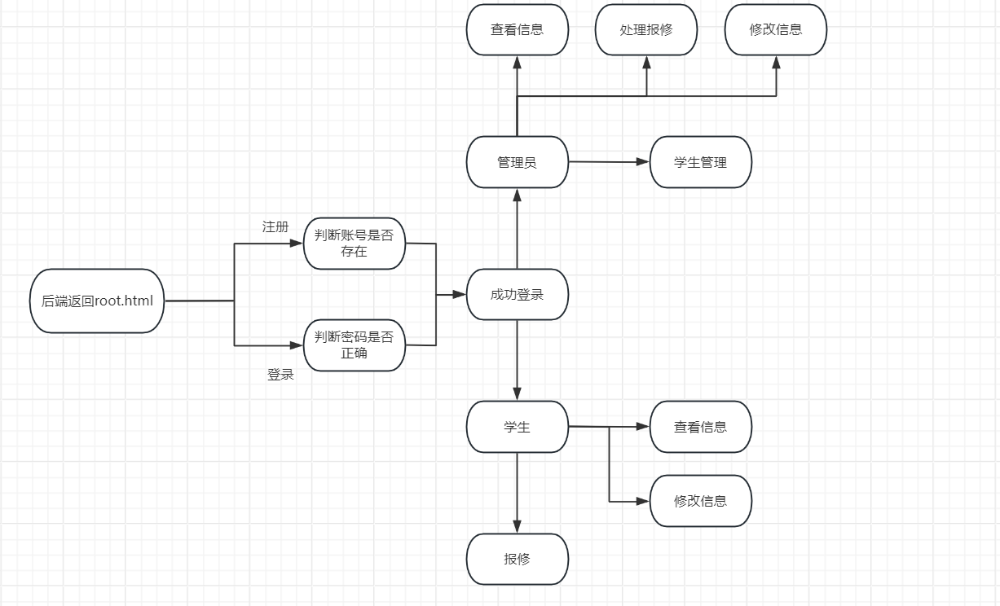

#### 数据库设计

> ER图
>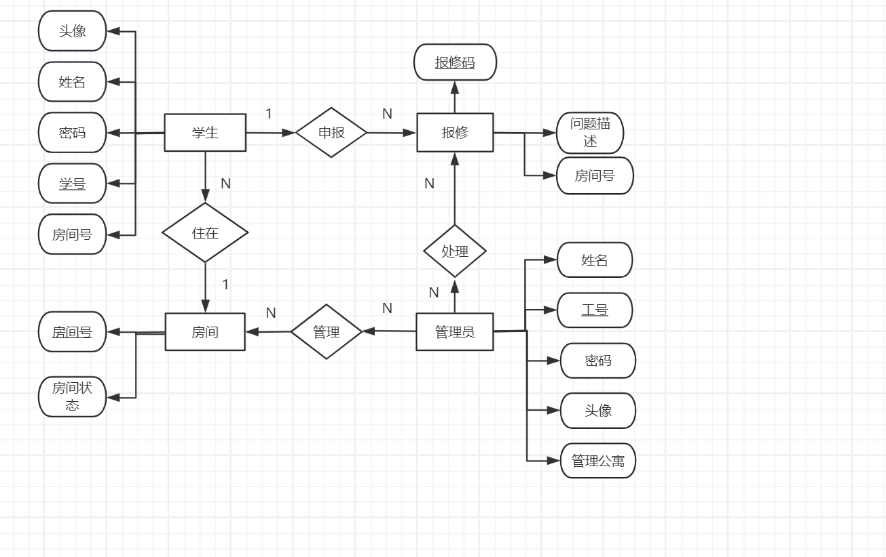
> 模式分解
> 满足3NF，所有实体只包含一个主码，且其余属性直接依赖主属性

##### 存储过程
实现的是一个维护房间表信息的一个功能。在学生进行信息修改时，或者在管理员删除学生时，就可以调用此存储过程，可以在对应房间删除这个学生，并且修改房间状态。同时修改这个学生的房间信息

##### 触发器
在对报修信息进行管理时，新建一个报修信息自动递增一个报修id作为主码，后续用来以此修改报修状态

##### 函数
计算房间平均入住，用所有的学生数除以房间数，返回这个平均值

## 核心代码解析（可改名为对应模块，如后端实现）

#### 仓库地址

> https://github.com/18241950925/db2024.git

#### 目录

├─mysql
│  ├─src  ......数据库创建
│  ├─procedure  ......存储过程，触发器，函数实现
├─static  ......静态库
│  ├─css
│  ├─figure
│  ├─fonts
│  ├─images
│  └─js
├─templates  ......前端界面
│   ├─administrator.html
│   ├─check_repair.html
│   ├─index.html ......登录界面
│   ├─room_management.html
│   ├─root.html
│   ├─smodify.html
│   ├─student.html   ......学生信息界面
│   ├─student_management.html
│   ├─test.html
│   ├─visitors.html
├─src.py ......后端文件
└─__pycache__

#### 前端实现
前端主要包括两个界面，登录界面与管理界面
1. 登录界面主要包括的是一个登录表

        //index.html
        <form action="/login" method="post">
            

                    <select class="form-control", name = 'identity'>
                    <option value="">选择你的身份</option>
                        <option>学生</option>
                        <option>管理员</option>
                    </select>
            

            

                <input type="text" class="top-up" name="id" placeholder="ID" required="">
            

            

                <input type="password" name="password" placeholder="Password" required="">

            

            

                <button type="submit">LOGIN</button> 
            

        </form>
    
    创建一个登录表选择身份类型，输入密码等，并使用post方法传递到后端
2. 信息管理界面
    侧边栏部分，之后在css与js文件中添加匹配弹出动画

        

            <ul class="sidebar-list">
            <li class="sidebar-item"><a href="#" class="sidebar-anchor" data-target="information-view">信息查看</a></li>
            <li class="sidebar-item"><a href="#" class="sidebar-anchor" data-target="information-modify">信息修改</a></li>
            <li class="sidebar-item"><a href="#" class="sidebar-anchor" data-target="report-repair">在线报修</a></li>
            <li class="sidebar-item"><a href="#" class="sidebar-anchor" data-target="logout">退出登录</a></li>
            </ul>
        

    信息查看部分，可以查看当前学生的所有信息，包括照片。在上传头像时，将其保存到本地的static文件夹下面，同时在学生表中存储相对路径

        <h2>查看信息</h2>
            <table>
                <thead>
                    <tr>
                        <th>头像</th>
                        <th>学号</th>
                        <th>姓名</th>
                        <th>联系方式</th>
                        <th>房间号</th>
                    </tr>
                </thead>
                <tbody>

                    <tr>
                        <td></td>
                        <td>{{ student.sid }}</td>
                        <td>{{ student.sname }}</td>
                        <td>{{ student.snumber }}</td>
                        <td>{{ student.room_number}}</td>
                    </tr>

                </tbody>
            </table>

3. 报修处理界面
    这个界面首先将所有未解决，即状态为0的保修信息做展示，并在后面加上选项框，管理员可以将所有勾选的选项提交，系统通过将checkbox传递到后端，自动修改报修状态

        form action="/submit_repairs" method="POST">
            
                <h3>未解决的报修记录</h3>
                <ul>
                
                    <li>
                    <input type="checkbox" name="selected_repairs" value="{{ repair.mid }}">
                    {{ repair.mroom }} - {{ repair.mstatus }} - {{ repair.mmessage }}
                    </li>
                
                </ul>
                <button type="submit">提交</button>
            
                
暂无未解决的报修记录

            
            </form>

#### 后端实现
//src.py
1. 数据库连接

        db_config = {
            'host': 'localhost',
            'user': 'root',
            'password': '',
            'db': 'db2024',
            'cursorclass': pymysql.cursors.DictCursor
        }
        # 创建数据库连接
        connection = pymysql.connect(**db_config)

2. 主界面部分
    使用render_template函数返回已经写好的登录界面

        @app.route('/', methods=['GET', 'POST'])
        def root():
            return render_template('index.html')

3. 修改信息函数
    对于这个函数，首先通过request获取前端输入的信息，之后通过try，commit实现事务编程的效果。
    首先保存图片到本地的static文件夹中，之后再调用存储过程修改房间信息，判断转入房间是否满人，最后更新对应的学生表

        @app.route('/smodify_information', methods=['POST'])
        def smodify_information():
            userid = request.form['userid']
            password = request.form['password']
            contact = request.form['contact']
            room_number = request.form['room-number']
            try:
                avatar = request.files['avatar']
                avatar_filename = secure_filename(avatar.filename)
                # avatar_path = os.path.join('./figure', avatar_filename)
                avatar_path = "./static/figure/" + avatar_filename
                avatar.save(avatar_path)
            except Exception as e:
                return '保存头像失败：' + str(e)
            try:
                with connection.cursor() as cursor:
                    ret = 0
                    cursor.callproc("ChangeRoom", [userid, room_number, ret])  # 进行房间更新
                    if ret == 4:
                        raise Exception('房间已满')
                    query = "UPDATE student SET spassword=%s, snumber=%s, room_number=%s, sfigure=%s WHERE sid=%s"
                    cursor.execute(query, (password, contact, room_number, avatar_filename, userid))
                    connection.commit()
            except Exception as e:
                return '修改信息失败：' + str(e)

            return redirect('/student_management?userid=' + userid)

    管理员的修改信息和这个类似

4. 管理员报修处理
    在前端实现了一个checkbox，用于存放所有选中的id信息，之后对于所有选中的报修代码，将他们的报修状态做修改

        @app.route('/deal_repair', methods=['POST'])
        def deal_repair():
            query_all = "SELECT * FROM maintenance"  # 查询所有报修记录
            query_unsolved = "SELECT * FROM maintenance WHERE mstatus = 0"  # 查询未解决报修记录
            option = request.form.get('repair-option')
            try:
                with connection.cursor() as cursor:
                    cursor.execute(query_all)
                    all_repairs = cursor.fetchall()
                    cursor.execute(query_unsolved)
                    unsolved_repairs = cursor.fetchall()
            except Exception as e:
                return '查看报修失败：' + str(e)
            return render_template('check_repair.html', all_repairs=all_repairs, unsolved_repairs=unsolved_repairs,
                                option=option)
其余部分实现对应的路由函数

#### 数据库部分代码
1. 触发器

        -- 用于自动递增报修id
        drop TRIGGER set_mid_trigger;
        DELIMITER //
        CREATE TRIGGER set_mid_trigger
        BEFORE INSERT ON maintenance
        FOR EACH ROW
        BEGIN
            DECLARE last_mid INT;
            declare flag int;
            select count(*) from maintenance into flag;
            if flag > 0 then
                SET last_mid = (SELECT MAX(mid) FROM maintenance);
                SET NEW.mid = last_mid + 1;
            else 
                SET NEW.mid = 0;
            end if;
        END //
        DELIMITER ;
2. 函数
    计算学生数，房间数，做除法

        DELIMITER //
        CREATE FUNCTION calculate_avg_students_per_room() RETURNS DECIMAL(10, 2)
        Reads SQL data
        BEGIN
            DECLARE total_students INT;
            DECLARE total_rooms INT;
            DECLARE avg_students DECIMAL(10, 2);

            SELECT COUNT(*) INTO total_students FROM student;

            SELECT COUNT(*) INTO total_rooms FROM room;

            -- 计算平均每个房间所住人数
            SET avg_students = total_students / total_rooms;

            RETURN avg_students;
        END //

        DELIMITER ;
3. 存储过程
    从原来的房间删除

        -- 检查原始房间是否有其他学生
        IF old_room_status > 0 THEN
            -- 从原始房间移除学生
            UPDATE room
            SET
            student1_id = CASE WHEN student1_id = stud_id THEN NULL ELSE student1_id END,
            student2_id = CASE WHEN student2_id = stud_id THEN NULL ELSE student2_id END,
            student3_id = CASE WHEN student3_id = stud_id THEN NULL ELSE student3_id END,
            student4_id = CASE WHEN student4_id = stud_id THEN NULL ELSE student4_id END,
            rstatus = rstatus - 1
            WHERE rnumber = old_room_number;
        END IF;
    在新的房间码为0时，说明是转出。

            -- 判断是否是转走
        if new_room_number =0 then
            set ret = 5;
            leave label;
            end if;
    否则在新的房间添加，且判断新房间人满没满

        -- 检查新房间是否已满
        IF new_room_status = 4 THEN
            set ret = 4;
            LEAVE label;
        END IF;
        
        -- 将学生添加到新房间
        UPDATE room
        SET
            student1_id = CASE WHEN student1_id IS NULL THEN stud_id ELSE student1_id END,
            student2_id = CASE WHEN student1_id != stud_id AND student2_id IS NULL THEN stud_id ELSE student2_id END,
            student3_id = CASE WHEN student1_id != stud_id AND student2_id != stud_id AND student3_id IS NULL THEN stud_id ELSE student3_id END,
            student4_id = CASE WHEN student1_id != stud_id AND student2_id != stud_id AND student3_id != stud_id AND student4_id IS NULL THEN stud_id ELSE student4_id END,
            rstatus = rstatus + 1
        WHERE rnumber = new_room_number;

## 实验与测试

#### 依赖

> flask
> pymysql
> 浏览器

#### 部署

> 直接运行src.py文件，之后浏览器打开http://127.0.0.1:5000

#### 实验结果

1. 增：通过注册实现
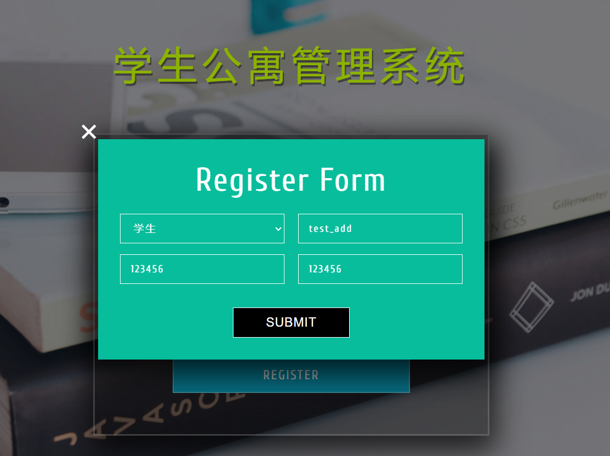
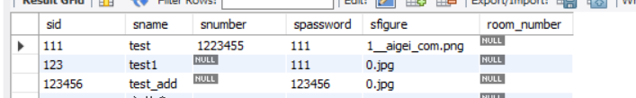

2. 改：修改信息实现
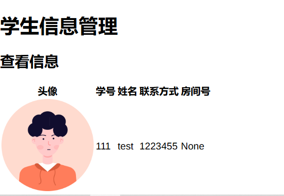
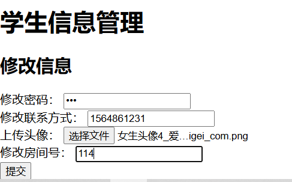
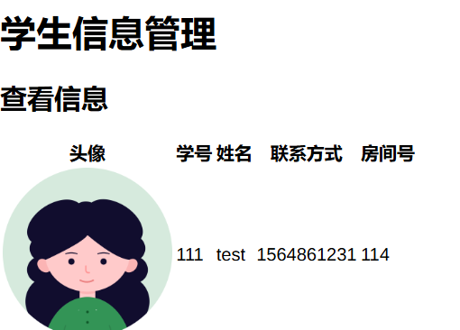

3. 查：管理员查看楼内学生
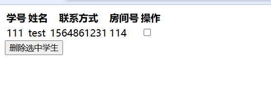

4. 删：从楼内删除学生，同时修改对应房间信息
一同展示存储过程changeroom
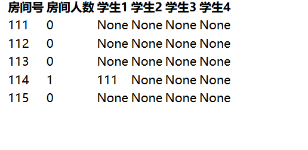
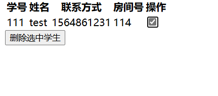
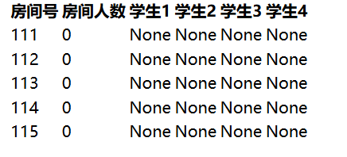

5. 函数： 显示平均房间入住人数

6. 触发器： 用于递增报修表id，在进行报修时，添加id作为主码
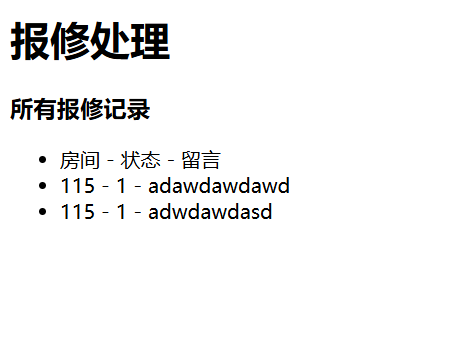
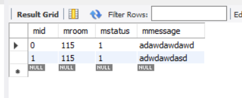

1. 访客管理
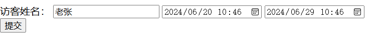
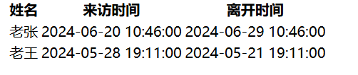

## 参考

> 登录界面：http://www.mobanwang.com/
> 信息管理界面：https://codepen.io/tonkec/pen/gryZmg
> 头像库来源 ：https://www.aigei.com/