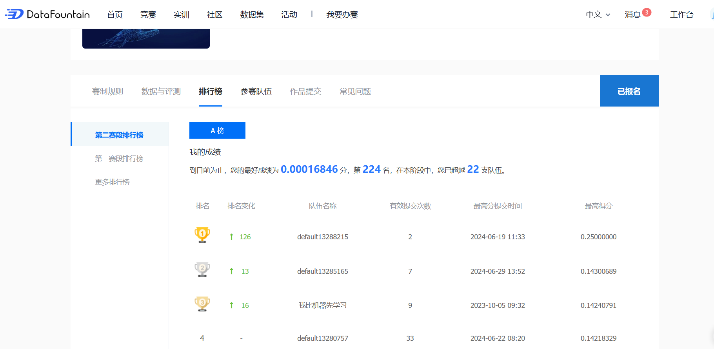

# 深度学习课程竞赛-图书推荐系统
### 小组成员：宋业鑫，高俊杰，王若言
### 赛题任务
依据真实世界中的用户-图书交互记录，利用机器学习相关技术，建立一个精确稳定的图书推荐系统，预测用户可能会进行阅读的书籍。
### 实验过程
1. 数据集划分
将给出的train dataset按照9:1划分训练集与验证集

        X = df['user_id']
        Y= df['item_id'] 
        x_train, x_valid, y_train, y_valid = train_test_split(X,Y,train_size=0.9,test_size=0.1,random_state=42,shuffle=False)
2. 模型选择
本项目属于推荐系统的问题，采用协同过滤的方法，基于用户-物品之间的相似性来推荐物品。按照模型的输出得分排序，将最高的分的物品作为推荐
3. 评测指标
采用F1值作为评测指标，可以直接调用sklearn库实现

        f1 = f1_score(y_valid.values, predict,average='weighted')

### 核心代码
1. MF模型
矩阵分解的协同过滤模型较为简单，主要原理就是对于每个用户与书籍做嵌入向量，之后通过两个向量的内积来确定他们之间的联系

         def forward(self, user_ids, item_ids):
              user_embedding = self.user_embedding(user_ids)
              item_embedding = self.item_embedding(item_ids)
              # 计算预测评分，这里使用点积作为评分
              scores = torch.sum(user_embedding * item_embedding, dim=1)
              return scores
2. LT-OCF模型
该模型LTOCF在传统NCF的基础上，进一步设计了网络结构与模型建模定义，具体来说提出ODE结果内的残差与可以学习的时间特征。
模型设计

        self.user_embedding = torch.nn.Embedding(num_users, embedding_dim)
        self.item_embedding = torch.nn.Embedding(num_items, embedding_dim)
        self.topic_embedding = torch.nn.Embedding(num_topics, embedding_dim)
        # 主题矩阵 Phi
        self.topic_matrix = torch.nn.Parameter(torch.randn(embedding_dim, embedding_dim))
        # 残差连接的全连接层
        self.residual_layer = torch.nn.Linear(embedding_dim, embedding_dim)
        # Dropout 
        self.dropout = torch.nn.Dropout(p=dropout_p)
        # Batch Normalization 层
        self.batch_norm = torch.nn.BatchNorm1d(embedding_dim)

添加了残差链接与归一化等用来提高模型性能
某次训练的损失图像

3. SASRec 
简单附上模型原理

- Input: 定义一个用户的行为序列 ，用于预测下一个用户可能发生交的物品但需要依赖之前用户的交互历史。
- Embedding Layer: 添加Positional Embedding表示序列中的先后关系，再与行为序列相加。
- Self-Attention: Stacking(Self-Attention Block+Feed Forward)并通过加入残差连接、layer normalization和dropout解决过拟合、梯度消失、训练时间长的问题。
- Output Layer :通过对用户行为序列和物品Embedding矩阵作内积得出user-item相关性矩阵，之后将分数排序筛选完成推荐

### 实验结果
1. 采用基于矩阵分解的协同过滤算法在验证集上的结果为
Validation F1 score: 9.069948177431624e-06
在平台提交结果为0.00016，排名224

2. 采用LT-OCF
由于时间关系没有进行调参，可能调参后效果会好一点

3. SASRec

### 小组分工
宋业鑫： 代码框架，MF模型， LT-OCF模型， 实验报告撰写
高俊杰： SASRec模型
王若言：调研文献