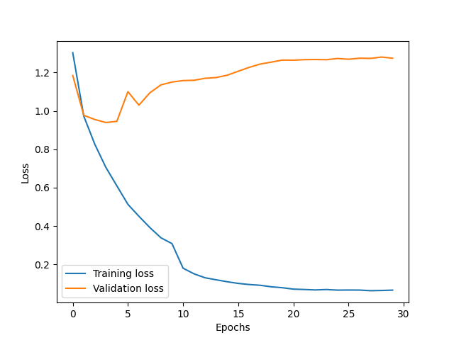
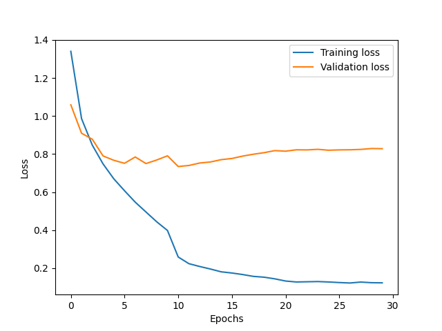
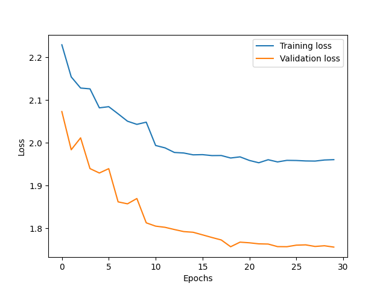
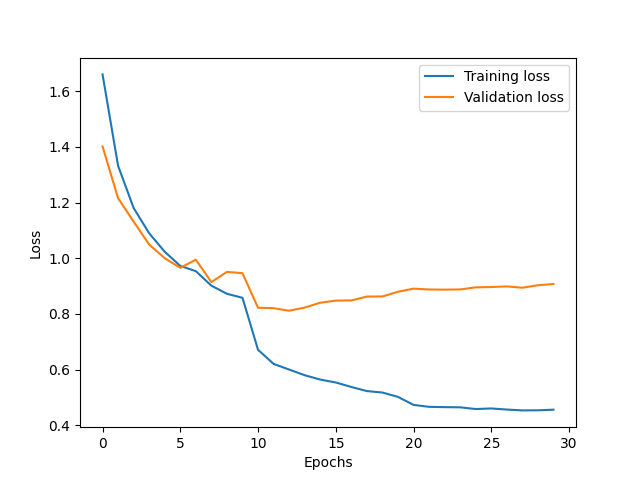

### Lab2
#### 实验步骤
1. 读取数据
    1. 直接通过torchvision.datasets.CIFAR10(root=data_root_dir, train=True/False, download=False)命令读取数据
   2. torch.utils.data.random_split对数据进行划分
2. 数据预处理
   1. 使用torchvision.transforms对数据进行预处理，包括数据的归一化transforms.Normalize((0.5, 0.5, 0.5), (0.5, 0.5, 0.5))]
3. 模型搭建
   1. 使用torch.nn.Conv2d方法搭建卷积层
   2. 使用torch.nn.Linear方法搭建全连接层
4. 模型训练
    1. 使用torch.optim.Adam方法搭建优化器
   2. 设置训练次数与学习率衰减
5. 模型测试
   通过返回验证集的损失与准确率判断测试结果
#### 调参分析
0. 网络深度
> 1. 使用2层卷积层,所得结果

> 2. 使用3层卷积层，所得结果

> 3. 可以看出，随着网络深度的增加，模型的准确率有所提升，但是在3层卷积层后，模型的准确率有所下降，可能是因为网络过深，导致梯度消失，模型的泛化能力下降
1. normalization
> 1. 使用BatchNorm2d方法对数据进行归一化处理，使得数据的均值为0，方差为1
   Epoch 30/30, Train Loss: 0.7777, Valid Loss: 0.8570, Valid Acc: 71.30%
> 2. 使用GroupNorm方法对数据进行归一化处理，取分组为4，所得结果无明显区别
> 3. 使用Instance Normalization的结果显著降低，可能是因为数据的维度较高，不适合使用Instance Normalization
2. dropout
> 1. 使用Dropout方法对数据进行处理，取概率为0.5
 Epoch 30/30, Train Loss: 0.7777, Valid Loss: 0.8570, Valid Acc: 71.30%
> 2. 取概率为0.3，Epoch 30/30, Train Loss: 0.5120, Valid Loss: 0.8503, Valid Acc: 73.35%

结果有一定的提升，dropout参数降低，模型的泛化能力增强，保留了更多的信息，使得模型的准确率有所提升
3. 卷积核大小
> 1. 使用3*3的卷积核，结果Epoch 30/30, Train Loss: 0.5120, Valid Loss: 0.8503, Valid Acc: 73.35%
> 2. 使用4*4的，结果无明显变化
>
4. 正则化
> 1.针对上述结果，发现验证集的损失在经历一定的迭代次数后就不再下降而训练集的损失函数一直在下降，推测模型发生过拟合现象，因此使用L2正则化方法对模型进行处理
> 
> 2.设置weight_decay=1e-5，结果无明显变化，可能是因为正则化参数设置过小
> 
> 3.在查阅资料后，发现1e-4是一个较好的参数，运行结果Epoch 30/30, Train Loss: 0.3775, Valid Loss: 0.7692, Valid Acc: 75.83%
> 发现有了一定的提升，模型的泛化能力增强，减少了过拟合现象

5.学习率
> 1.设置学习率为0.01，使用的是adma优化器，但是虽然adma可以自动的动态优化学习率,不过经查阅资料和实践发现,手动添加学习率衰减策略可以更好的优化模型
> scheduler = optim.lr_scheduler.StepLR(optimizer, step_size=decay_epoch, gamma=learning_rate_decay),按照10个epoch衰减一次学习率，衰减系数为0.1

6.网络深度与宽度
> 1.初始设置为2层全连接层，两层卷积层，卷积层的通道数为64，全连接层位256.
> 
> 经过测试发现模型结果准确率较低，因此修改为3层卷积层，3层全连接层，所得准确率有所提升，不过过拟合的现象更加的明显
> 因此对应的提升前述的正则化参数，所得结果有所提升，准确率达到80%

### 测试结果
Test Loss: 1.1577, Test Accuracy: 80.79%