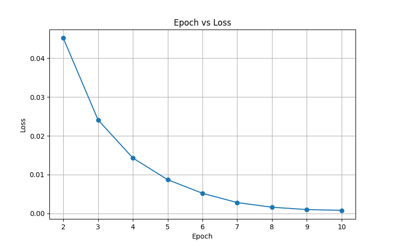
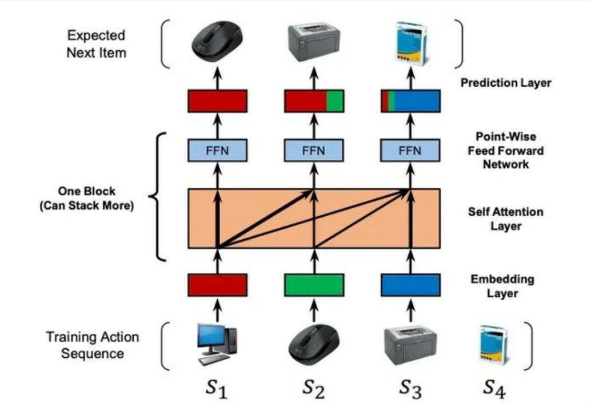
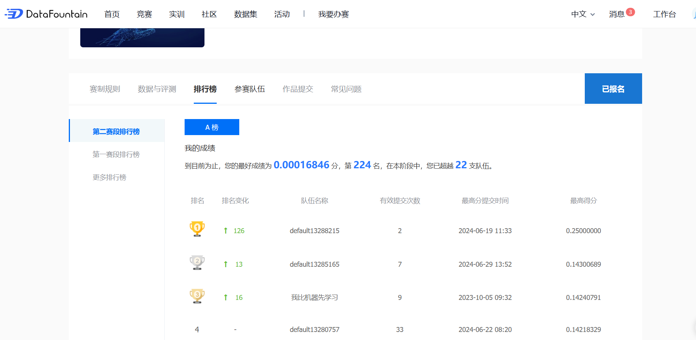
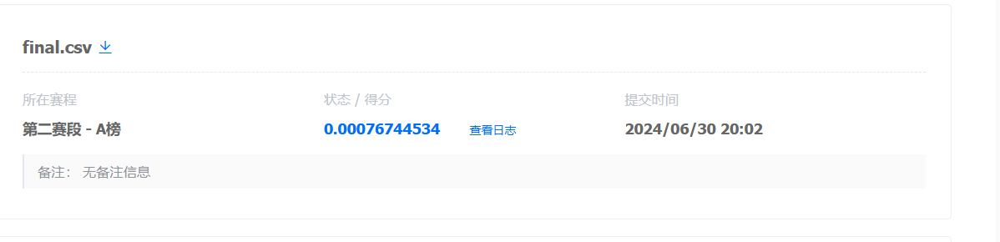
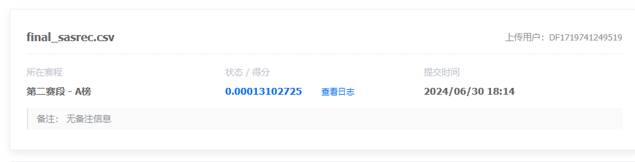

# 深度学习课程竞赛-图书推荐系统
### 小组成员：宋业鑫，高俊杰，王若言,孙一鸣
### 赛题任务
依据真实世界中的用户-图书交互记录，利用机器学习相关技术，建立一个精确稳定的图书推荐系统，预测用户可能会进行阅读的书籍。
### 实验过程
1. 数据集划分
将给出的train dataset按照9:1划分训练集与验证集

        X = df['user_id']
        Y= df['item_id'] 
        x_train, x_valid, y_train, y_valid = train_test_split(X,Y,train_size=0.9,test_size=0.1,random_state=42,shuffle=False)
2. 模型选择
本项目属于推荐系统的问题，采用协同过滤的方法，基于用户-物品之间的相似性来推荐物品。按照模型的输出得分排序，将最高的分的物品作为推荐
3. 评测指标
采用F1值作为评测指标，可以直接调用sklearn库实现

        f1 = f1_score(y_valid.values, predict,average='weighted')

### 核心代码
1. ##### MF模型

矩阵分解的协同过滤模型较为简单，主要原理就是对于每个用户与书籍做嵌入向量，之后通过两个向量的内积来确定他们之间的联系
   
         def forward(self, user_ids, item_ids):
              user_embedding = self.user_embedding(user_ids)
              item_embedding = self.item_embedding(item_ids)
              # 计算预测评分，这里使用点积作为评分
              scores = torch.sum(user_embedding * item_embedding, dim=1)
              return scores
2. ##### LT-OCF模型

该模型LTOCF在传统NCF的基础上，进一步设计了网络结构与模型建模定义，具体来说提出ODE结果内的残差与可以学习的时间特征。
模型设计
   
        self.user_embedding = torch.nn.Embedding(num_users, embedding_dim)
        self.item_embedding = torch.nn.Embedding(num_items, embedding_dim)
        self.topic_embedding = torch.nn.Embedding(num_topics, embedding_dim)
        # 主题矩阵 Phi
        self.topic_matrix = torch.nn.Parameter(torch.randn(embedding_dim, embedding_dim))
        # 残差连接的全连接层
        self.residual_layer = torch.nn.Linear(embedding_dim, embedding_dim)
        # Dropout 
        self.dropout = torch.nn.Dropout(p=dropout_p)
        # Batch Normalization 层
        self.batch_norm = torch.nn.BatchNorm1d(embedding_dim)

添加了残差链接与归一化等用来提高模型性能
某次训练的损失图像

3. ##### SASRec 

  基于自注意力和前馈网络的序列推荐模型，采用多头自注意力和逐点前馈网络层堆叠，以深入理解用户行为序列并提供精准推荐。  它利用了自注意力机制来捕捉用户行为的时间序列依赖性，并对用户的未来行为做出预测。 

  模型设计核心代码和注解

  ~~~python
  class SASRec(torch.nn.Module):
      def __init__(self, user_num, item_num, args):
          super(SASRec, self).__init__()
  
          self.user_num = user_num  # 用户数量
          self.item_num = item_num  # 项目数量
          self.dev = args.device  # 模型运行的设备
  
          # 训练过程中对嵌入向量进行正则化
          self.item_emb = torch.nn.Embedding(self.item_num+1, args.hidden_units, padding_idx=0)  # 物品嵌入
          self.pos_emb = torch.nn.Embedding(args.maxlen, args.hidden_units)  # 位置嵌入，待改进
          self.emb_dropout = torch.nn.Dropout(p=args.dropout_rate)  # 嵌入层后的dropout
  
          self.attention_layernorms = torch.nn.ModuleList()  # 自注意力层前的层归一化
          self.attention_layers = torch.nn.ModuleList()  # 自注意力层列表
          self.forward_layernorms = torch.nn.ModuleList()  # 前馈网络层前的层归一化
          self.forward_layers = torch.nn.ModuleList()  # 前馈网络层列表
  
          self.last_layernorm = torch.nn.LayerNorm(args.hidden_units, eps=1e-8)  # 最后一个层归一化
  
          for _ in range(args.num_blocks):  # 根据设置的块数构建模型
              new_attn_layernorm = torch.nn.LayerNorm(args.hidden_units, eps=1e-8)
              self.attention_layernorms.append(new_attn_layernorm)
  
              new_attn_layer = torch.nn.MultiheadAttention(args.hidden_units,
                                                           args.num_heads,
                                                           args.dropout_rate)  # 多头自注意力层
              self.attention_layers.append(new_attn_layer)
  
              new_fwd_layernorm = torch.nn.LayerNorm(args.hidden_units, eps=1e-8)
              self.forward_layernorms.append(new_fwd_layernorm)
  
              new_fwd_layer = PointWiseFeedForward(args.hidden_units, args.dropout_rate)  # 逐点前馈层
              self.forward_layers.append(new_fwd_layer)
  
              # self.pos_sigmoid = torch.nn.Sigmoid()
              # self.neg_sigmoid = torch.nn.Sigmoid()
  
  ~~~

  此模型需要额外处理输入数据

  如下**generate_sequences**基于序列的推荐模型处理和构建输入数据集。它接收一个包含用户行为数据的 DataFrame，通过处理用户的交互历史来生成适用于模型训练的序列 

  ~~~python
  def generate_sequences(df, user_col='user_id', item_col='item_id', maxlen=50):
      # 使用 defaultdict 创建一个字典来记录每个用户的物品交互历史
      user_history = defaultdict(list)
      device = torch.device('cuda')
      for user, item in zip(df[user_col], df[item_col]):
          user_history[user].append(item)  # 为每个用户追加交互过的物品
  
      all_items = set(df[item_col].unique())  # 获取所有唯一的物品集合
  
      log_seqs = []  # 存储每个用户的日志序列
      pos_seqs = []  # 存储每个用户的正样本序列
      neg_seqs = []  # 存储每个用户的负样本序列
      user_ids = []  # 存储用户ID
  
      for user, history in user_history.items():
          # 如果历史长度小于maxlen，用0填充至maxlen
          log_seq = history[:maxlen] + [0] * (maxlen - len(history))
          pos_seq = log_seq  # 正样本直接使用日志序列
          neg_items = list(all_items - set(history))  # 生成未交互过的负样本集
          neg_seq = neg_items[:maxlen] + [0] * (maxlen - len(neg_items))  # 负样本序列，同样填充至maxlen
  
          log_seqs.append(log_seq)  # 添加日志序列
          pos_seqs.append(pos_seq)  # 添加正样本序列
          neg_seqs.append(neg_seq)  # 添加负样本序列
          user_ids.append(user)  # 记录用户ID
  
      # 创建一个包含所有商品索引的张量
      item_indices_tensor = torch.tensor(list(all_items), dtype=torch.long)
  
      return (
          torch.tensor(user_ids, dtype=torch.long),  # 用户ID张量
          torch.tensor(log_seqs, dtype=torch.long),  # 日志序列张量
          torch.tensor(pos_seqs, dtype=torch.long),  # 正样本序列张量
          torch.tensor(neg_seqs, dtype=torch.long),  # 负样本序列张量
          item_indices_tensor  # 所有商品索引张量
      )
  
  ~~~

  

  简单附上模型原理
  
### 实验结果
1. 采用基于矩阵分解的协同过滤算法在验证集上的结果为
  Validation F1 score: 9.069948177431624e-06
  在平台提交结果为0.00016，排名224
  

2. 采用LT-OCF
  由于时间关系没有进行调参，可能调参后效果会好一点
  

3. SASRec

   按理来说这个方法效果应该不错，但不知道是调参的问题还是网络结构有问题，训练的时候很快就收敛了（5epoch左右），最后评测的效果也不是很理想

   

### 小组分工
宋业鑫： 代码框架，MF模型， LT-OCF模型， 实验报告撰写
高俊杰： SASRec模型，实验报告撰写
王若言：调研文献